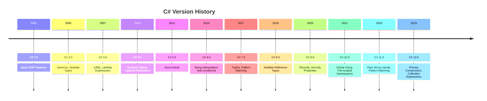
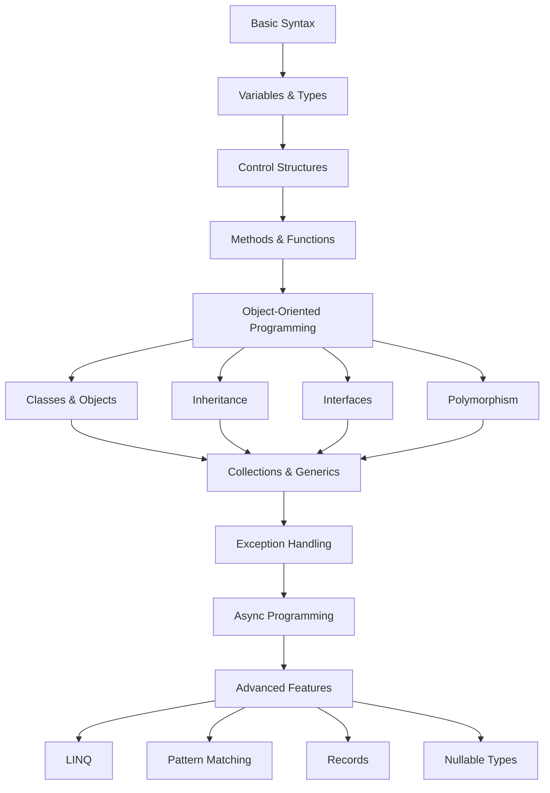

# Getting to Know C# Programming Language

## What is C#?

C# (pronounced "C-Sharp") is a **modern, object-oriented programming language** developed by Microsoft. It's designed to be simple, powerful, and type-safe, making it ideal for building various types of applications on the .NET platform.

## C# Language Features

### Modern Language Design

```csharp
// Modern C# syntax examples
var greeting = "Hello, World!";
var numbers = new List<int> { 1, 2, 3, 4, 5 };
var person = new { Name = "John", Age = 30 };

// Null-conditional operators
string result = person?.Name?.ToUpper();

// String interpolation
Console.WriteLine($"Hello, {person.Name}!");
```

## C# Language Evolution



## Basic Syntax and Structure

### Hello World Program

```csharp
// Traditional approach
using System;

namespace HelloWorld
{
    class Program
    {
        static void Main(string[] args)
        {
            Console.WriteLine("Hello, World!");
        }
    }
}

// Modern approach (C# 9.0+)
using System;

Console.WriteLine("Hello, World!");
```

### Variables and Data Types

```csharp
// Value types
int age = 25;
double price = 99.99;
bool isActive = true;
char initial = 'A';
decimal salary = 50000.00m;

// Reference types
string name = "John Doe";
object data = new { Id = 1, Name = "Product" };

// Nullable types
int? optionalNumber = null;
string? optionalText = null;

// Implicitly typed variables
var number = 42;           // int
var text = "Hello";        // string
var list = new List<int>(); // List<int>
```

### Constants and Readonly

```csharp
// Constants (compile-time)
const int MAX_SIZE = 100;
const string COMPANY_NAME = "TechCorp";

// Readonly (runtime)
readonly DateTime createdAt = DateTime.Now;

public class Configuration
{
    public static readonly string ConnectionString = 
        Environment.GetEnvironmentVariable("DB_CONNECTION");
}
```

## Object-Oriented Programming

### Classes and Objects

```csharp
// Class definition
public class Person
{
    // Fields
    private string _firstName;
    private string _lastName;
    
    // Properties
    public string FirstName 
    { 
        get => _firstName; 
        set => _firstName = value?.Trim(); 
    }
    
    public string LastName 
    { 
        get => _lastName; 
        set => _lastName = value?.Trim(); 
    }
    
    // Auto-implemented property
    public int Age { get; set; }
    
    // Read-only property
    public string FullName => $"{FirstName} {LastName}";
    
    // Constructor
    public Person(string firstName, string lastName, int age)
    {
        FirstName = firstName;
        LastName = lastName;
        Age = age;
    }
    
    // Methods
    public void Introduce()
    {
        Console.WriteLine($"Hi, I'm {FullName} and I'm {Age} years old.");
    }
    
    public bool IsAdult() => Age >= 18;
}

// Using the class
var person = new Person("John", "Doe", 30);
person.Introduce();
Console.WriteLine($"Is adult: {person.IsAdult()}");
```

### Inheritance

```csharp
// Base class
public class Animal
{
    public string Name { get; set; }
    public int Age { get; set; }
    
    public virtual void MakeSound()
    {
        Console.WriteLine("The animal makes a sound");
    }
    
    public virtual void Move()
    {
        Console.WriteLine("The animal moves");
    }
}

// Derived class
public class Dog : Animal
{
    public string Breed { get; set; }
    
    public override void MakeSound()
    {
        Console.WriteLine($"{Name} barks: Woof! Woof!");
    }
    
    public override void Move()
    {
        Console.WriteLine($"{Name} runs around");
    }
    
    public void Fetch()
    {
        Console.WriteLine($"{Name} fetches the ball");
    }
}

// Usage
var dog = new Dog 
{ 
    Name = "Buddy", 
    Age = 3, 
    Breed = "Golden Retriever" 
};

dog.MakeSound(); // Buddy barks: Woof! Woof!
dog.Move();      // Buddy runs around
dog.Fetch();     // Buddy fetches the ball
```

### Interfaces

```csharp
// Interface definition
public interface IShape
{
    double Area { get; }
    double Perimeter { get; }
    void Draw();
}

// Interface implementation
public class Rectangle : IShape
{
    public double Width { get; set; }
    public double Height { get; set; }
    
    public double Area => Width * Height;
    public double Perimeter => 2 * (Width + Height);
    
    public void Draw()
    {
        Console.WriteLine($"Drawing rectangle: {Width}x{Height}");
    }
}

public class Circle : IShape
{
    public double Radius { get; set; }
    
    public double Area => Math.PI * Radius * Radius;
    public double Perimeter => 2 * Math.PI * Radius;
    
    public void Draw()
    {
        Console.WriteLine($"Drawing circle with radius: {Radius}");
    }
}

// Using interfaces
List<IShape> shapes = new List<IShape>
{
    new Rectangle { Width = 10, Height = 5 },
    new Circle { Radius = 3 }
};

foreach (IShape shape in shapes)
{
    shape.Draw();
    Console.WriteLine($"Area: {shape.Area:F2}");
}
```

## Collections and Generics

### Common Collections

```csharp
// Arrays
int[] numbers = { 1, 2, 3, 4, 5 };
string[] names = new string[3] { "John", "Jane", "Bob" };

// Lists
List<string> fruits = new List<string> { "Apple", "Banana", "Orange" };
fruits.Add("Grape");
fruits.Remove("Banana");

// Dictionaries
Dictionary<string, int> ages = new Dictionary<string, int>
{
    ["John"] = 30,
    ["Jane"] = 25,
    ["Bob"] = 35
};

// HashSet (unique values)
HashSet<string> uniqueNames = new HashSet<string> { "John", "Jane", "John" };
// uniqueNames contains only "John" and "Jane"

// Queue (FIFO)
Queue<string> taskQueue = new Queue<string>();
taskQueue.Enqueue("Task 1");
taskQueue.Enqueue("Task 2");
string nextTask = taskQueue.Dequeue(); // "Task 1"

// Stack (LIFO)
Stack<string> history = new Stack<string>();
history.Push("Page 1");
history.Push("Page 2");
string currentPage = history.Pop(); // "Page 2"
```

### LINQ (Language Integrated Query)

```csharp
List<Person> people = new List<Person>
{
    new Person("John", "Doe", 30),
    new Person("Jane", "Smith", 25),
    new Person("Bob", "Johnson", 35),
    new Person("Alice", "Brown", 28)
};

// LINQ query syntax
var adults = from person in people
             where person.Age >= 30
             orderby person.Age
             select person;

// LINQ method syntax
var youngAdults = people
    .Where(p => p.Age >= 25 && p.Age < 30)
    .OrderBy(p => p.LastName)
    .Select(p => new { p.FullName, p.Age })
    .ToList();

// Common LINQ operations
var averageAge = people.Average(p => p.Age);
var oldestPerson = people.OrderByDescending(p => p.Age).First();
var namesList = people.Select(p => p.FullName).ToList();
var groupsByAge = people.GroupBy(p => p.Age >= 30 ? "Adult" : "Young");
```

## Exception Handling

```csharp
public class FileProcessor
{
    public string ReadFile(string filePath)
    {
        try
        {
            // Attempt to read file
            return File.ReadAllText(filePath);
        }
        catch (FileNotFoundException ex)
        {
            Console.WriteLine($"File not found: {ex.Message}");
            throw; // Re-throw to let caller handle
        }
        catch (UnauthorizedAccessException ex)
        {
            Console.WriteLine($"Access denied: {ex.Message}");
            return string.Empty;
        }
        catch (Exception ex)
        {
            Console.WriteLine($"Unexpected error: {ex.Message}");
            throw new InvalidOperationException("Failed to read file", ex);
        }
        finally
        {
            // Cleanup code (always executes)
            Console.WriteLine("File operation completed");
        }
    }
}

// Custom exception
public class InvalidAgeException : Exception
{
    public InvalidAgeException(int age) 
        : base($"Invalid age: {age}. Age must be between 0 and 150.")
    {
        Age = age;
    }
    
    public int Age { get; }
}

// Using custom exception
public void SetAge(int age)
{
    if (age < 0 || age > 150)
        throw new InvalidAgeException(age);
        
    Age = age;
}
```

## Async Programming

```csharp
public class DataService
{
    private readonly HttpClient _httpClient = new HttpClient();
    
    // Async method
    public async Task<string> GetDataAsync(string url)
    {
        try
        {
            HttpResponseMessage response = await _httpClient.GetAsync(url);
            response.EnsureSuccessStatusCode();
            
            string content = await response.Content.ReadAsStringAsync();
            return content;
        }
        catch (HttpRequestException ex)
        {
            Console.WriteLine($"Request failed: {ex.Message}");
            throw;
        }
    }
    
    // Async method with multiple operations
    public async Task<List<string>> GetMultipleDataAsync(List<string> urls)
    {
        List<Task<string>> tasks = urls.Select(GetDataAsync).ToList();
        string[] results = await Task.WhenAll(tasks);
        return results.ToList();
    }
}

// Using async methods
public async Task ProcessDataAsync()
{
    var service = new DataService();
    
    // Sequential execution
    string data1 = await service.GetDataAsync("https://api.example.com/data1");
    string data2 = await service.GetDataAsync("https://api.example.com/data2");
    
    // Parallel execution
    List<string> urls = new List<string>
    {
        "https://api.example.com/data1",
        "https://api.example.com/data2",
        "https://api.example.com/data3"
    };
    
    List<string> results = await service.GetMultipleDataAsync(urls);
}
```

## Modern C# Features

### Records (C# 9.0+)

```csharp
// Record definition
public record Person(string FirstName, string LastName, int Age)
{
    public string FullName => $"{FirstName} {LastName}";
}

// Usage
var person1 = new Person("John", "Doe", 30);
var person2 = person1 with { Age = 31 }; // Create copy with modified property

// Value equality
Console.WriteLine(person1 == person2); // False
Console.WriteLine(person1.FirstName == person2.FirstName); // True
```

### Pattern Matching

```csharp
public string DescribeObject(object obj)
{
    return obj switch
    {
        int n when n > 0 => $"Positive number: {n}",
        int n when n < 0 => $"Negative number: {n}",
        int => "Zero",
        string s when s.Length > 10 => $"Long string: {s[..10]}...",
        string s => $"String: {s}",
        List<int> list => $"List with {list.Count} items",
        null => "Null value",
        _ => "Unknown type"
    };
}

// Using pattern matching
Console.WriteLine(DescribeObject(42));        // Positive number: 42
Console.WriteLine(DescribeObject("Hello"));   // String: Hello
Console.WriteLine(DescribeObject(null));      // Null value
```

### Nullable Reference Types (C# 8.0+)

```csharp
#nullable enable

public class UserService
{
    // Non-nullable reference type
    public string GetUserName(int userId)
    {
        // Must return non-null string
        return GetUserFromDatabase(userId)?.Name ?? "Unknown";
    }
    
    // Nullable reference type
    public string? FindUserEmail(int userId)
    {
        // Can return null
        return GetUserFromDatabase(userId)?.Email;
    }
    
    private User? GetUserFromDatabase(int userId)
    {
        // Implementation details...
        return null; // Compiler knows this can be null
    }
}

public class User
{
    public string Name { get; set; } = string.Empty; // Must be initialized
    public string? Email { get; set; } // Can be null
}
```

## C# Programming Concepts Flow



## Best Practices

### Naming Conventions

```csharp
// Classes, Methods, Properties - PascalCase
public class UserService
{
    public string GetUserName() { ... }
    public int UserId { get; set; }
}

// Fields, Variables, Parameters - camelCase
private string _userName;
public void ProcessUser(string firstName) { ... }

// Constants - PascalCase
public const int MaxRetryCount = 3;

// Interfaces - Start with 'I'
public interface IUserRepository { ... }
```

### Code Organization

```csharp
// Organize using statements
using System;
using System.Collections.Generic;
using System.Linq;
using Microsoft.Extensions.Logging;

// Namespace matches folder structure
namespace MyApp.Services.User
{
    // Class summary documentation
    /// <summary>
    /// Provides user-related operations and data access
    /// </summary>
    public class UserService
    {
        // Dependencies injection
        private readonly ILogger<UserService> _logger;
        private readonly IUserRepository _userRepository;
        
        public UserService(ILogger<UserService> logger, IUserRepository userRepository)
        {
            _logger = logger ?? throw new ArgumentNullException(nameof(logger));
            _userRepository = userRepository ?? throw new ArgumentNullException(nameof(userRepository));
        }
    }
}
```

## Common Patterns

### Repository Pattern

```csharp
public interface IUserRepository
{
    Task<User?> GetByIdAsync(int id);
    Task<List<User>> GetAllAsync();
    Task<User> CreateAsync(User user);
    Task UpdateAsync(User user);
    Task DeleteAsync(int id);
}

public class UserRepository : IUserRepository
{
    private readonly DbContext _context;
    
    public UserRepository(DbContext context)
    {
        _context = context;
    }
    
    public async Task<User?> GetByIdAsync(int id)
    {
        return await _context.Users.FindAsync(id);
    }
    
    // Other implementations...
}
```

### Dependency Injection

```csharp
// Service registration
public void ConfigureServices(IServiceCollection services)
{
    services.AddScoped<IUserRepository, UserRepository>();
    services.AddScoped<IUserService, UserService>();
}

// Service usage
public class UserController : ControllerBase
{
    private readonly IUserService _userService;
    
    public UserController(IUserService userService)
    {
        _userService = userService;
    }
}
```

## Learning Path

### Beginner Level
1. **Basic Syntax**: Variables, data types, operators
2. **Control Flow**: if/else, loops, switch
3. **Methods**: Parameters, return values, overloading
4. **Classes**: Properties, constructors, methods

### Intermediate Level
1. **OOP Concepts**: Inheritance, polymorphism, interfaces
2. **Collections**: Lists, dictionaries, LINQ
3. **Exception Handling**: try/catch/finally, custom exceptions
4. **File I/O**: Reading/writing files, streams

### Advanced Level
1. **Async Programming**: async/await, Tasks, parallel processing
2. **Generics**: Generic classes, constraints, variance
3. **Delegates & Events**: Event handling, functional programming
4. **Reflection**: Runtime type inspection, dynamic loading

## Next Steps

After mastering C# basics:

1. **[Understand .NET project structure](dotnet-project-structure.md)**
2. **[Learn .NET CLI commands](dotnet-cli-basics.md)**
3. **[Explore NuGet package management](nuget-management.md)**
4. **[Build your first .NET project](dotnet-first-project.md)**

## Summary

C# is a powerful, modern programming language that offers:

| Feature | Benefit |
|---------|---------|
| **Strong Typing** | Compile-time error detection |
| **Object-Oriented** | Code reusability and maintainability |
| **Memory Management** | Automatic garbage collection |
| **Rich Libraries** | Extensive Base Class Library |
| **Cross-Platform** | Runs on multiple operating systems |
| **Modern Syntax** | Expressive and readable code |

C# combines the power of C++ with the simplicity of Visual Basic, making it an excellent choice for both beginners and experienced developers building modern applications.
