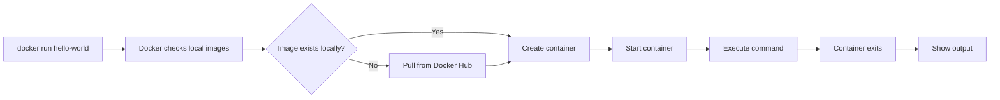
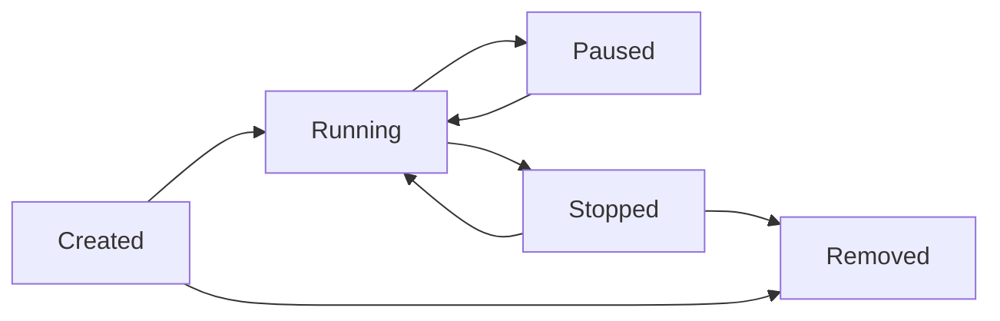

# Creating and Running Your First Container

## Overview

Creating your first Docker container is an exciting milestone in learning containerization. This guide walks you through running existing containers, creating your own, and understanding container fundamentals through hands-on examples.

## Prerequisites

Ensure Docker is installed and running:

```bash
# Verify Docker installation
docker --version
docker info

# Test Docker with hello-world
docker run hello-world
```

## Running Your First Container

### Hello World Container

```bash
# Run the classic hello-world container
docker run hello-world

# Expected output:
# Hello from Docker!
# This message shows that your installation appears to be working correctly.
```

### Understanding What Happened



## Running Interactive Containers

### Ubuntu Container with Shell

```bash
# Run Ubuntu container interactively
docker run -it ubuntu:20.04 /bin/bash

# You're now inside the container!
# Try some commands:
cat /etc/os-release
ls -la
whoami
hostname

# Exit the container
exit
```

### Command Breakdown

```bash
docker run -it ubuntu:20.04 /bin/bash
#    │   │  │             │
#    │   │  │             └── Command to run
#    │   │  └── Image name and tag
#    │   └── Interactive mode + pseudo-TTY
#    └── Run command
```

### Exploring Different Distributions

```bash
# Try different Linux distributions
docker run -it alpine:latest /bin/sh
docker run -it centos:7 /bin/bash
docker run -it debian:bullseye /bin/bash

# Each container is isolated and independent
```

## Running Web Applications

### Simple Web Server

```bash
# Run Nginx web server
docker run -d -p 8080:80 --name my-nginx nginx:latest

# Flags explained:
# -d: Run in detached mode (background)
# -p 8080:80: Map host port 8080 to container port 80
# --name: Give container a custom name
```

### Test the Web Server

```bash
# Test with curl
curl http://localhost:8080

# Or open in browser: http://localhost:8080
# You should see the Nginx welcome page
```

### Apache Web Server

```bash
# Run Apache HTTP server
docker run -d -p 8081:80 --name my-apache httpd:latest

# Test it
curl http://localhost:8081
```

## Container Management

### Listing Containers

```bash
# List running containers
docker ps

# List all containers (running and stopped)
docker ps -a

# List container IDs only
docker ps -q
```

### Stopping and Starting Containers

```bash
# Stop a running container
docker stop my-nginx

# Start a stopped container
docker start my-nginx

# Restart a container
docker restart my-nginx

# Check container status
docker ps
```

### Container Logs

```bash
# View container logs
docker logs my-nginx

# Follow logs in real-time
docker logs -f my-nginx

# Show last 10 lines
docker logs --tail 10 my-nginx

# Show logs with timestamps
docker logs -t my-nginx
```

## Creating Your First Custom Container

### Method 1: Modify Existing Container

#### Step 1: Start with Base Image

```bash
# Run Ubuntu container
docker run -it --name my-custom ubuntu:20.04 /bin/bash
```

#### Step 2: Install Software Inside Container

```bash
# Inside the container, install packages
apt update
apt install -y curl wget vim htop

# Create a simple script
echo '#!/bin/bash
echo "Hello from my custom container!"
echo "Current date: $(date)"
echo "System info: $(uname -a)"' > /usr/local/bin/hello.sh

chmod +x /usr/local/bin/hello.sh

# Test the script
hello.sh

# Exit container
exit
```

#### Step 3: Commit Changes to New Image

```bash
# Create new image from modified container
docker commit my-custom my-custom-ubuntu:v1.0

# Verify new image
docker images | grep my-custom

# Run container from new image
docker run -it my-custom-ubuntu:v1.0 hello.sh
```

### Method 2: Using Dockerfile (Recommended)

#### Step 1: Create Project Directory

```bash
# Create directory for your first container
mkdir my-first-container
cd my-first-container
```

#### Step 2: Create Application Files

```bash
# Create a simple Python web application
cat > app.py << 'EOF'
#!/usr/bin/env python3
import http.server
import socketserver
import datetime
import os

PORT = int(os.environ.get('PORT', 8000))

class MyHTTPRequestHandler(http.server.SimpleHTTPRequestHandler):
    def do_GET(self):
        if self.path == '/':
            self.send_response(200)
            self.send_header('Content-type', 'text/html')
            self.end_headers()
            
            html_content = f"""
            <!DOCTYPE html>
            <html>
            <head>
                <title>My First Container App</title>
                <style>
                    body {{ font-family: Arial, sans-serif; margin: 40px; }}
                    .container {{ max-width: 600px; margin: 0 auto; }}
                    .info {{ background: #f0f0f0; padding: 20px; border-radius: 5px; }}
                </style>
            </head>
            <body>
                <div class="container">
                    <h1>🐳 My First Container Application</h1>
                    <div class="info">
                        <p><strong>Current Time:</strong> {datetime.datetime.now()}</p>
                        <p><strong>Server Port:</strong> {PORT}</p>
                        <p><strong>Container ID:</strong> {os.uname().nodename}</p>
                        <p><strong>Python Version:</strong> {os.sys.version}</p>
                    </div>
                    <h2>Congratulations! 🎉</h2>
                    <p>You've successfully created and deployed your first containerized application!</p>
                </div>
            </body>
            </html>
            """
            
            self.wfile.write(html_content.encode())
        else:
            super().do_GET()

if __name__ == "__main__":
    with socketserver.TCPServer(("", PORT), MyHTTPRequestHandler) as httpd:
        print(f"Server running on port {PORT}")
        print(f"Visit http://localhost:{PORT}")
        httpd.serve_forever()
EOF

chmod +x app.py
```

#### Step 3: Create Dockerfile

```dockerfile
# Dockerfile
FROM python:3.11-slim

# Set working directory
WORKDIR /app

# Copy application file
COPY app.py .

# Expose port
EXPOSE 8000

# Create non-root user for security
RUN groupadd -r appuser && useradd -r -g appuser appuser
RUN chown -R appuser:appuser /app
USER appuser

# Command to run application
CMD ["python", "app.py"]
```

#### Step 4: Build Your Image

```bash
# Build the image
docker build -t my-first-app:1.0 .

# Verify the image was created
docker images | grep my-first-app
```

#### Step 5: Run Your Container

```bash
# Run your custom container
docker run -d -p 8000:8000 --name my-app my-first-app:1.0

# Test the application
curl http://localhost:8000

# Or visit http://localhost:8000 in your browser
```

## Advanced Container Operations

### Environment Variables

```bash
# Run container with environment variables
docker run -d -p 8001:8000 \
  -e PORT=8000 \
  -e APP_NAME="My Custom App" \
  --name my-app-env \
  my-first-app:1.0

# View container environment
docker exec my-app-env env
```

### Volume Mounting

```bash
# Create local directory
mkdir app-data

# Run container with volume mount
docker run -d -p 8002:8000 \
  -v $(pwd)/app-data:/app/data \
  --name my-app-volume \
  my-first-app:1.0

# File changes in app-data/ will be reflected in container
```

### Container Networking

```bash
# Create custom network
docker network create my-network

# Run containers on custom network
docker run -d --network my-network --name app1 my-first-app:1.0
docker run -d --network my-network --name app2 my-first-app:1.0

# Containers can communicate using names
docker exec app1 ping app2
```

## Multi-Container Application

### Step 1: Create Database Container

```bash
# Run MySQL database
docker run -d \
  --name my-database \
  -e MYSQL_ROOT_PASSWORD=secret \
  -e MYSQL_DATABASE=myapp \
  -e MYSQL_USER=appuser \
  -e MYSQL_PASSWORD=apppass \
  -p 3306:3306 \
  mysql:8.0
```

### Step 2: Create Web Application with Database Connection

```python
# Create db_app.py
cat > db_app.py << 'EOF'
#!/usr/bin/env python3
import http.server
import socketserver
import json
import os
import mysql.connector
from urllib.parse import urlparse, parse_qs

PORT = int(os.environ.get('PORT', 8000))
DB_HOST = os.environ.get('DB_HOST', 'localhost')
DB_USER = os.environ.get('DB_USER', 'appuser')
DB_PASS = os.environ.get('DB_PASS', 'apppass')
DB_NAME = os.environ.get('DB_NAME', 'myapp')

class DatabaseHandler(http.server.SimpleHTTPRequestHandler):
    def get_db_connection(self):
        try:
            return mysql.connector.connect(
                host=DB_HOST,
                user=DB_USER,
                password=DB_PASS,
                database=DB_NAME
            )
        except Exception as e:
            return None
    
    def do_GET(self):
        if self.path == '/':
            self.send_response(200)
            self.send_header('Content-type', 'text/html')
            self.end_headers()
            
            # Try to connect to database
            conn = self.get_db_connection()
            if conn:
                status = "✅ Database Connected"
                conn.close()
            else:
                status = "❌ Database Connection Failed"
            
            html = f"""
            <!DOCTYPE html>
            <html>
            <head><title>Database App</title></head>
            <body>
                <h1>🐳 Multi-Container Application</h1>
                <p><strong>Database Status:</strong> {status}</p>
                <p><strong>Database Host:</strong> {DB_HOST}</p>
                <p><strong>App Port:</strong> {PORT}</p>
            </body>
            </html>
            """
            self.wfile.write(html.encode())
        else:
            super().do_GET()

if __name__ == "__main__":
    with socketserver.TCPServer(("", PORT), DatabaseHandler) as httpd:
        print(f"Database app running on port {PORT}")
        httpd.serve_forever()
EOF
```

### Step 3: Create Dockerfile for Database App

```dockerfile
# Dockerfile.db
FROM python:3.11-slim

# Install MySQL connector
RUN pip install mysql-connector-python

WORKDIR /app
COPY db_app.py .

RUN groupadd -r appuser && useradd -r -g appuser appuser
RUN chown -R appuser:appuser /app
USER appuser

EXPOSE 8000
CMD ["python", "db_app.py"]
```

### Step 4: Build and Run Database App

```bash
# Build database app image
docker build -f Dockerfile.db -t my-db-app:1.0 .

# Run with connection to database
docker run -d -p 8003:8000 \
  -e DB_HOST=my-database \
  -e DB_USER=appuser \
  -e DB_PASS=apppass \
  -e DB_NAME=myapp \
  --link my-database:my-database \
  --name my-db-app \
  my-db-app:1.0

# Test the application
curl http://localhost:8003
```

## Container Inspection and Debugging

### Inspect Container Details

```bash
# Get detailed container information
docker inspect my-app

# Get specific information
docker inspect my-app | grep IPAddress
docker inspect my-app | jq '.[0].Config.Env'

# Show container processes
docker top my-app

# Show container resource usage
docker stats my-app --no-stream
```

### Execute Commands in Running Container

```bash
# Execute bash shell in running container
docker exec -it my-app /bin/bash

# Execute single command
docker exec my-app ls -la /app
docker exec my-app ps aux
docker exec my-app cat /etc/passwd

# Execute as root user
docker exec -u root -it my-app /bin/bash
```

### Debugging Container Issues

```bash
# View container logs
docker logs my-app

# Follow logs
docker logs -f my-app

# Check why container stopped
docker ps -a
docker logs container-name

# Inspect container changes
docker diff my-app
```

## Container Lifecycle Management

### Container States



### Managing Container Lifecycle

```bash
# Create container without starting
docker create --name my-created-app my-first-app:1.0

# Start created container
docker start my-created-app

# Pause running container
docker pause my-app

# Unpause container
docker unpause my-app

# Stop container gracefully
docker stop my-app

# Kill container forcefully
docker kill my-app

# Remove stopped container
docker rm my-app

# Remove running container (force)
docker rm -f my-app
```

## Cleanup and Best Practices

### Cleaning Up Containers

```bash
# Remove all stopped containers
docker container prune

# Remove specific container
docker rm my-nginx my-apache

# Remove running container (force)
docker rm -f my-app

# Remove all containers (dangerous!)
docker rm -f $(docker ps -aq)
```

### Cleaning Up Images

```bash
# Remove unused images
docker image prune

# Remove specific image
docker rmi my-first-app:1.0

# Remove all images (dangerous!)
docker rmi $(docker images -q)
```

### Resource Monitoring

```bash
# Monitor resource usage
docker stats

# Monitor specific containers
docker stats my-app my-nginx

# Show disk usage
docker system df

# Show detailed disk usage
docker system df -v
```

## Common Patterns and Examples

### Development Environment

```bash
# Run development container with code mounting
docker run -it \
  -v $(pwd):/workspace \
  -w /workspace \
  -p 8000:8000 \
  python:3.11 \
  bash

# Inside container: python app.py
```

### Quick Database for Testing

```bash
# PostgreSQL for development
docker run -d \
  --name dev-postgres \
  -e POSTGRES_PASSWORD=dev \
  -e POSTGRES_DB=testdb \
  -p 5432:5432 \
  postgres:15

# Redis for caching
docker run -d \
  --name dev-redis \
  -p 6379:6379 \
  redis:alpine
```

### File Processing Container

```bash
# Process files with temporary container
docker run --rm \
  -v $(pwd)/input:/input \
  -v $(pwd)/output:/output \
  ubuntu:20.04 \
  bash -c "cp /input/* /output/ && echo 'Files processed'"
```

## Security Best Practices

### Run as Non-Root User

```dockerfile
# In Dockerfile
RUN groupadd -r appuser && useradd -r -g appuser appuser
USER appuser
```

### Limit Resources

```bash
# Limit memory and CPU
docker run -d \
  --memory=512m \
  --cpus=1.0 \
  --name limited-app \
  my-first-app:1.0
```

### Read-Only Filesystem

```bash
# Run with read-only filesystem
docker run -d \
  --read-only \
  --tmpfs /tmp \
  --name readonly-app \
  my-first-app:1.0
```

## Troubleshooting Common Issues

### Container Won't Start

```bash
# Check logs for errors
docker logs container-name

# Try running interactively
docker run -it image-name /bin/bash

# Check image exists
docker images | grep image-name
```

### Port Already in Use

```bash
# Find what's using the port
sudo lsof -i :8080

# Use different port
docker run -p 8081:80 nginx
```

### Permission Issues

```bash
# Run as root for debugging
docker exec -u root -it container-name /bin/bash

# Check file ownership
docker exec container-name ls -la /app
```

## Next Steps

After mastering your first container:

1. **[Learn image management](docker-image-management.md)**
2. **[Master Docker volumes](docker-volumes.md)**
3. **[Understand Docker networking](docker-networking-basics.md)**
4. **[Explore Docker Compose](docker-compose.md)**

## Summary

You've successfully:

| Achievement | Description |
|-------------|-------------|
| **Run existing containers** | Used pre-built images from Docker Hub |
| **Created custom containers** | Built your own containerized applications |
| **Managed container lifecycle** | Started, stopped, and monitored containers |
| **Connected containers** | Created multi-container applications |
| **Applied best practices** | Implemented security and resource management |

These fundamentals provide the foundation for more advanced Docker concepts and real-world containerization scenarios.
