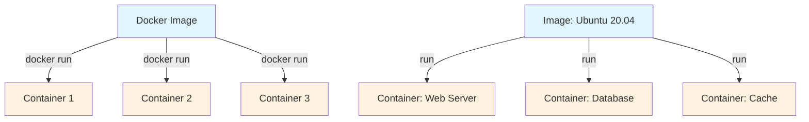
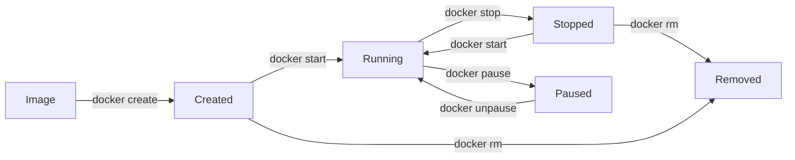
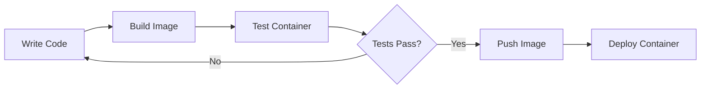

# Understanding Image and Container Concepts

## What are Docker Images?

Docker images are **read-only templates** used to create containers. Think of them as blueprints or snapshots that contain:

- **Application code**
- **Runtime environment**
- **System libraries**
- **Dependencies**
- **Configuration files**
- **Environment variables**

### Image Characteristics

- **Immutable**: Once created, images don't change
- **Layered**: Built using a layered filesystem
- **Portable**: Can run on any system with Docker
- **Versionable**: Can be tagged with different versions

## What are Docker Containers?

Containers are **running instances** of Docker images. They are:

- **Lightweight**: Share the host OS kernel
- **Isolated**: Run in their own process space
- **Temporary**: Can be created, started, stopped, and deleted
- **Stateful**: Can maintain state during runtime

## Image vs Container Relationship



## Docker Image Layers

Images are built using a **layered filesystem**. Each layer represents a change or addition:

```
┌─────────────────────────┐  ← Container Layer (Read/Write)
├─────────────────────────┤
│    Application Code     │  ← Layer 4 (Read-Only)
├─────────────────────────┤
│    Dependencies         │  ← Layer 3 (Read-Only)
├─────────────────────────┤
│    Runtime Environment  │  ← Layer 2 (Read-Only)
├─────────────────────────┤
│    Base OS             │  ← Layer 1 (Read-Only)
└─────────────────────────┘
```

### Layer Benefits

1. **Storage Efficiency**: Shared layers between images
2. **Fast Downloads**: Only new layers are downloaded
3. **Caching**: Build cache speeds up image creation
4. **Version Control**: Easy to track changes

## Container Lifecycle



### Container States

| State | Description | Commands |
|-------|-------------|----------|
| **Created** | Container exists but not started | `docker create` |
| **Running** | Container is actively running | `docker start`, `docker run` |
| **Stopped** | Container stopped but still exists | `docker stop` |
| **Paused** | Container paused (processes frozen) | `docker pause` |
| **Removed** | Container deleted from system | `docker rm` |

## Working with Images

### Pulling Images

```bash
# Pull image from Docker Hub
docker pull ubuntu:20.04
docker pull nginx:latest
docker pull node:18-alpine

# Pull from specific registry
docker pull gcr.io/google-containers/nginx
```

### Listing Images

```bash
# List all images
docker images

# List with specific format
docker images --format "table {{.Repository}}\t{{.Tag}}\t{{.Size}}"

# List image IDs only
docker images -q
```

### Image Information

```bash
# Inspect image details
docker inspect ubuntu:20.04

# View image history (layers)
docker history ubuntu:20.04

# Check image size and usage
docker system df
```

### Removing Images

```bash
# Remove specific image
docker rmi ubuntu:20.04

# Remove image by ID
docker rmi 1a2b3c4d5e6f

# Remove unused images
docker image prune

# Remove all images
docker rmi $(docker images -q)
```

## Working with Containers

### Creating and Running Containers

```bash
# Run container from image
docker run ubuntu:20.04

# Run with interactive terminal
docker run -it ubuntu:20.04 /bin/bash

# Run in background (detached)
docker run -d nginx:latest

# Run with custom name
docker run --name my-nginx -d nginx:latest

# Run with port mapping
docker run -p 8080:80 -d nginx:latest
```

### Container Management

```bash
# List running containers
docker ps

# List all containers (including stopped)
docker ps -a

# Start stopped container
docker start container-name

# Stop running container
docker stop container-name

# Restart container
docker restart container-name

# Remove container
docker rm container-name
```

### Container Interaction

```bash
# Execute command in running container
docker exec -it container-name /bin/bash

# View container logs
docker logs container-name

# Follow logs in real-time
docker logs -f container-name

# Copy files to/from container
docker cp file.txt container-name:/path/
docker cp container-name:/path/file.txt ./
```

## Practical Examples

### Example 1: Running a Web Server

```bash
# Pull and run Nginx
docker run -d \
  --name my-web-server \
  -p 8080:80 \
  nginx:latest

# Access the server
curl http://localhost:8080
```

### Example 2: Running a Database

```bash
# Run MySQL database
docker run -d \
  --name my-database \
  -e MYSQL_ROOT_PASSWORD=secret \
  -e MYSQL_DATABASE=myapp \
  -p 3306:3306 \
  mysql:8.0
```

### Example 3: Development Environment

```bash
# Run Node.js development environment
docker run -it \
  --name node-dev \
  -v $(pwd):/app \
  -w /app \
  -p 3000:3000 \
  node:18 \
  /bin/bash
```

## Image Naming and Tagging

### Naming Convention

```
[registry]/[namespace]/[repository]:[tag]
```

Examples:
```bash
# Official images
ubuntu:20.04
nginx:latest
node:18-alpine

# User/organization images
mycompany/webapp:v1.0
username/myapp:latest

# Private registry
registry.company.com/team/app:production
```

### Tagging Images

```bash
# Tag existing image
docker tag ubuntu:20.04 my-ubuntu:custom

# Tag for registry
docker tag myapp:latest registry.company.com/myapp:v1.0

# Multiple tags for same image
docker tag myapp:latest myapp:stable
docker tag myapp:latest myapp:v1.0.0
```

## Container Filesystem

### Container Layers

```
Container Layer (Read/Write)
├── /var/log/app.log        ← New files
├── /etc/config.conf        ← Modified files
└── /tmp/cache/             ← Temporary files

Image Layers (Read-Only)
├── Layer 3: Application
├── Layer 2: Dependencies  
├── Layer 1: Base OS
└── Layer 0: Kernel (Host)
```

### Data Persistence

Containers are **ephemeral** by default. To persist data:

```bash
# Using volumes
docker run -v mydata:/data ubuntu:20.04

# Using bind mounts
docker run -v /host/path:/container/path ubuntu:20.04

# Using tmpfs mounts
docker run --tmpfs /tmp ubuntu:20.04
```

## Best Practices

### Image Best Practices

1. **Use official base images**
   ```dockerfile
   FROM node:18-alpine
   ```

2. **Use specific tags**
   ```dockerfile
   FROM ubuntu:20.04  # Not ubuntu:latest
   ```

3. **Minimize layers**
   ```dockerfile
   RUN apt-get update && apt-get install -y \
       curl \
       vim \
       && rm -rf /var/lib/apt/lists/*
   ```

4. **Use .dockerignore**
   ```
   node_modules
   .git
   *.log
   ```

### Container Best Practices

1. **Run as non-root user**
   ```dockerfile
   USER appuser
   ```

2. **Use proper signals**
   ```bash
   docker stop container-name  # Sends SIGTERM
   ```

3. **Resource limits**
   ```bash
   docker run --memory=512m --cpus=1.0 myapp
   ```

4. **Health checks**
   ```dockerfile
   HEALTHCHECK --interval=30s --timeout=3s \
     CMD curl -f http://localhost/ || exit 1
   ```

## Common Patterns

### Development Workflow



### Multi-Stage Development

```bash
# Development
docker run -v $(pwd):/app -it node:18 /bin/bash

# Testing
docker run --rm -v $(pwd):/app node:18 npm test

# Production
docker build -t myapp:prod .
docker run -d myapp:prod
```

## Troubleshooting

### Common Issues

```bash
# Container exits immediately
docker logs container-name

# Check container processes
docker exec container-name ps aux

# Inspect container configuration
docker inspect container-name

# Monitor resource usage
docker stats container-name
```

### Debug Commands

```bash
# Run container with override
docker run -it --entrypoint /bin/bash image-name

# Check container filesystem changes
docker diff container-name

# Export container as tar
docker export container-name > container.tar
```

## Summary

| Concept | Description | Key Commands |
|---------|-------------|--------------|
| **Image** | Read-only template | `docker pull`, `docker images`, `docker rmi` |
| **Container** | Running instance | `docker run`, `docker ps`, `docker stop` |
| **Layer** | Filesystem change | `docker history`, `docker inspect` |
| **Registry** | Image storage | `docker push`, `docker pull` |

Understanding images and containers is fundamental to working with Docker effectively. Images serve as the foundation, while containers provide the runtime environment where your applications actually execute.

## Next Steps

- [Learn essential Docker commands](docker-essential-commands.md)
- [Create your first container](docker-first-container.md)
- [Build custom images with Dockerfile](docker-dockerfile.md)
