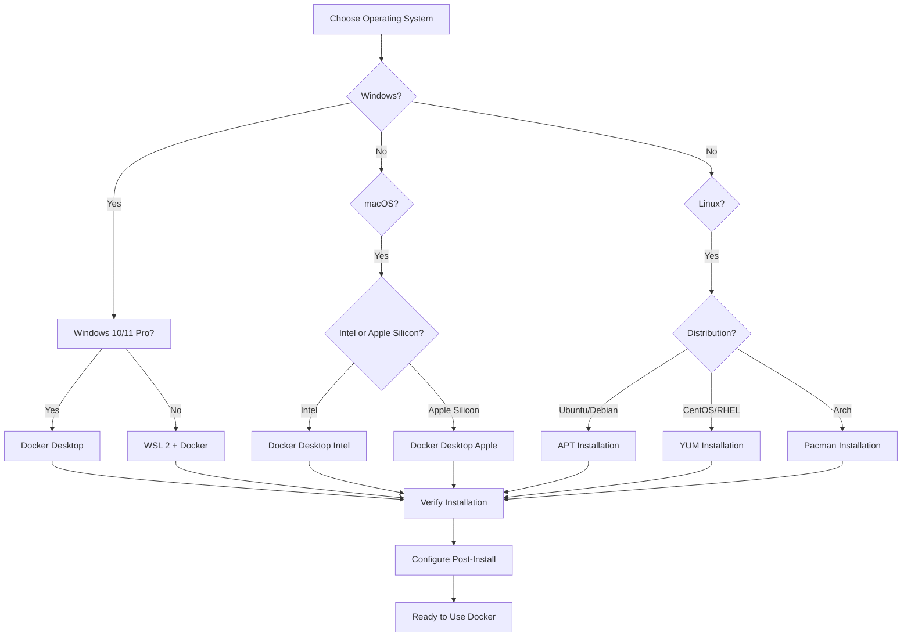

# Installing Docker on Various Operating Systems

## Prerequisites

Before installing Docker, ensure your system meets the minimum requirements:

- **64-bit operating system**
- **Sufficient RAM** (4GB recommended)
- **Virtualization support** enabled in BIOS
- **Administrator/root privileges**

## Windows Installation

### Windows 10/11 Pro, Enterprise, or Education

#### Method 1: Docker Desktop (Recommended)

1. **Download Docker Desktop**
   ```
   Visit: https://www.docker.com/products/docker-desktop
   Download: Docker Desktop for Windows
   ```

2. **Install Docker Desktop**
   - Run the installer as Administrator
   - Follow the installation wizard
   - Enable WSL 2 integration when prompted

3. **Post-Installation Setup**
   ```powershell
   # Verify installation
   docker --version
   docker run hello-world
   ```

#### Method 2: Docker Engine on WSL 2

1. **Install WSL 2**
   ```powershell
   wsl --install
   wsl --set-default-version 2
   ```

2. **Install Docker in WSL 2**
   ```bash
   # Update package list
   sudo apt update
   
   # Install prerequisites
   sudo apt install apt-transport-https ca-certificates curl gnupg lsb-release
   
   # Add Docker's official GPG key
   curl -fsSL https://download.docker.com/linux/ubuntu/gpg | sudo gpg --dearmor -o /usr/share/keyrings/docker-archive-keyring.gpg
   
   # Add Docker repository
   echo "deb [arch=amd64 signed-by=/usr/share/keyrings/docker-archive-keyring.gpg] https://download.docker.com/linux/ubuntu $(lsb_release -cs) stable" | sudo tee /etc/apt/sources.list.d/docker.list > /dev/null
   
   # Install Docker
   sudo apt update
   sudo apt install docker-ce docker-ce-cli containerd.io
   
   # Start Docker service
   sudo service docker start
   
   # Add user to docker group
   sudo usermod -aG docker $USER
   ```

### Windows 10 Home

For Windows 10 Home, you need to:

1. **Enable WSL 2** first
2. **Install Docker Desktop with WSL 2 backend**

## macOS Installation

### Intel Macs

1. **Download Docker Desktop**
   ```
   Visit: https://www.docker.com/products/docker-desktop
   Download: Docker Desktop for Mac (Intel chip)
   ```

2. **Install Docker Desktop**
   ```bash
   # Mount the DMG file
   # Drag Docker.app to Applications folder
   # Launch Docker from Applications
   ```

3. **Verify Installation**
   ```bash
   docker --version
   docker run hello-world
   ```

### Apple Silicon Macs (M1/M2)

1. **Download Docker Desktop**
   ```
   Download: Docker Desktop for Mac (Apple chip)
   ```

2. **Install and Configure**
   ```bash
   # Same installation process
   # Rosetta 2 may be required for x86 images
   
   # Install Rosetta 2 if needed
   /usr/sbin/softwareupdate --install-rosetta
   ```

## Linux Installation

### Ubuntu/Debian

```bash
# Remove old versions
sudo apt-get remove docker docker-engine docker.io containerd runc

# Update package index
sudo apt-get update

# Install prerequisites
sudo apt-get install \
    apt-transport-https \
    ca-certificates \
    curl \
    gnupg \
    lsb-release

# Add Docker's official GPG key
curl -fsSL https://download.docker.com/linux/ubuntu/gpg | sudo gpg --dearmor -o /usr/share/keyrings/docker-archive-keyring.gpg

# Set up stable repository
echo \
  "deb [arch=amd64 signed-by=/usr/share/keyrings/docker-archive-keyring.gpg] https://download.docker.com/linux/ubuntu \
  $(lsb_release -cs) stable" | sudo tee /etc/apt/sources.list.d/docker.list > /dev/null

# Install Docker Engine
sudo apt-get update
sudo apt-get install docker-ce docker-ce-cli containerd.io

# Start and enable Docker
sudo systemctl start docker
sudo systemctl enable docker

# Add user to docker group
sudo usermod -aG docker $USER

# Verify installation
docker --version
sudo docker run hello-world
```

### CentOS/RHEL/Fedora

```bash
# Remove old versions
sudo yum remove docker \
                  docker-client \
                  docker-client-latest \
                  docker-common \
                  docker-latest \
                  docker-latest-logrotate \
                  docker-logrotate \
                  docker-engine

# Install yum-utils
sudo yum install -y yum-utils

# Add Docker repository
sudo yum-config-manager \
    --add-repo \
    https://download.docker.com/linux/centos/docker-ce.repo

# Install Docker Engine
sudo yum install docker-ce docker-ce-cli containerd.io

# Start Docker
sudo systemctl start docker
sudo systemctl enable docker

# Add user to docker group
sudo usermod -aG docker $USER

# Verify installation
docker --version
sudo docker run hello-world
```

### Arch Linux

```bash
# Update system
sudo pacman -Syu

# Install Docker
sudo pacman -S docker

# Start and enable Docker
sudo systemctl start docker.service
sudo systemctl enable docker.service

# Add user to docker group
sudo usermod -aG docker $USER

# Verify installation
docker --version
sudo docker run hello-world
```

## Post-Installation Configuration

### Configure Docker to Start on Boot

**Linux (systemd):**
```bash
sudo systemctl enable docker
```

**Windows/macOS:**
Docker Desktop starts automatically by default.

### Configure Docker Without Sudo (Linux)

```bash
# Add current user to docker group
sudo usermod -aG docker $USER

# Log out and log back in, or run:
newgrp docker

# Test without sudo
docker run hello-world
```

### Configure Docker Daemon

Create `/etc/docker/daemon.json`:

```json
{
  "data-root": "/var/lib/docker",
  "storage-driver": "overlay2",
  "log-driver": "json-file",
  "log-opts": {
    "max-size": "10m",
    "max-file": "3"
  },
  "default-address-pools": [
    {
      "base": "172.17.0.0/16",
      "size": 24
    }
  ]
}
```

Then restart Docker:
```bash
sudo systemctl restart docker
```

## Installation Verification

### Basic Commands Test

```bash
# Check Docker version
docker --version
docker version

# Check Docker info
docker info

# Run test container
docker run hello-world

# List images
docker images

# List containers
docker ps -a
```

### Resource Usage Check

```bash
# Check system resources
docker system info
docker system df

# Monitor Docker events
docker events
```

## Troubleshooting Common Issues

### Permission Denied

```bash
# Solution: Add user to docker group
sudo usermod -aG docker $USER
# Then log out and log back in
```

### Docker Daemon Not Running

```bash
# Start Docker service
sudo systemctl start docker

# Check status
sudo systemctl status docker
```

### WSL 2 Issues (Windows)

```powershell
# Ensure WSL 2 is installed and set as default
wsl --list --verbose
wsl --set-default-version 2

# Update WSL
wsl --update
```

### Virtualization Not Enabled

1. **Access BIOS/UEFI**
2. **Enable Intel VT-x or AMD-V**
3. **Enable Hyper-V (Windows)**

## Docker Installation Flow



## Next Steps

After successful installation:

1. **[Learn Docker concepts](docker-image-container-concepts.md)**
2. **[Master essential commands](docker-essential-commands.md)**
3. **[Create your first container](docker-first-container.md)**

## Installation Summary

| OS | Method | Difficulty | Notes |
|----|--------|------------|-------|
| **Windows Pro/Enterprise** | Docker Desktop | Easy | Hyper-V required |
| **Windows Home** | WSL 2 + Docker | Medium | Requires WSL 2 setup |
| **macOS** | Docker Desktop | Easy | Different for Intel/Apple Silicon |
| **Ubuntu/Debian** | APT Package Manager | Easy | Most straightforward |
| **CentOS/RHEL** | YUM Package Manager | Easy | Enterprise-friendly |
| **Arch Linux** | Pacman | Medium | Rolling release considerations |

Choose the installation method that best fits your operating system and requirements. Docker Desktop provides the easiest experience for Windows and macOS users, while Linux users have more flexibility with native Docker Engine installation.
