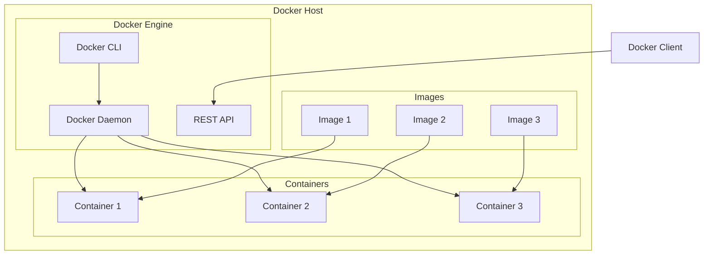

# Introduction to Docker: What and Why?

## What is Docker?

Docker is a containerization platform that allows you to package applications and their dependencies into lightweight, portable containers. Think of containers as standardized units that include everything needed to run an application: code, runtime, system tools, libraries, and settings.

## Key Concepts

### Virtual Machines vs Containers

```
Virtual Machines                    Containers
┌─────────────────────┐            ┌─────────────────────┐
│    Application      │            │    Application      │
├─────────────────────┤            ├─────────────────────┤
│    Guest OS         │            │    Dependencies     │
├─────────────────────┤            ├─────────────────────┤
│    Hypervisor       │            │  Container Runtime  │
├─────────────────────┤            ├─────────────────────┤
│    Host OS          │            │    Host OS          │
└─────────────────────┘            └─────────────────────┘
```

## Why Use Docker?

### 1. **Consistency Across Environments**
- "It works on my machine" problem solved
- Same environment from development to production
- Eliminates environment-specific bugs

### 2. **Lightweight and Fast**
- Containers share the host OS kernel
- Start in seconds, not minutes
- Less resource overhead compared to VMs

### 3. **Scalability**
- Easy horizontal scaling
- Orchestration with Docker Swarm or Kubernetes
- Microservices architecture support

### 4. **Isolation**
- Applications run in isolated environments
- Dependencies don't conflict
- Security through separation

### 5. **Portability**
- Run anywhere Docker is installed
- Cloud provider agnostic
- Easy migration between environments

## Docker Architecture



## Core Components

### 1. **Docker Engine**
The runtime that manages containers, images, networks, and volumes.

### 2. **Docker Images**
Read-only templates used to create containers. Like a blueprint or snapshot.

### 3. **Docker Containers**
Running instances of Docker images. Lightweight and executable.

### 4. **Dockerfile**
Text file with instructions to build Docker images.

### 5. **Docker Registry**
Storage and distribution system for Docker images (e.g., Docker Hub).

## Real-World Use Cases

### Development
- Consistent development environments
- Easy onboarding for new team members
- Testing across different versions

### Testing
- Isolated test environments
- Parallel testing
- CI/CD pipeline integration

### Production Deployment
- Microservices architecture
- Container orchestration
- Cloud-native applications

### DevOps
- Infrastructure as Code
- Continuous deployment
- Environment parity

## Docker Workflow


## Benefits Summary

| Benefit | Description |
|---------|-------------|
| **Efficiency** | Better resource utilization than VMs |
| **Speed** | Fast startup and deployment |
| **Consistency** | Same environment everywhere |
| **Scalability** | Easy to scale up or down |
| **Security** | Isolated application environments |
| **Cost-effective** | Reduced infrastructure costs |

## Getting Started

To begin your Docker journey:

1. **Install Docker** on your system
2. **Learn basic commands** (docker run, docker build, docker pull)
3. **Create your first Dockerfile**
4. **Build and run your first container**
5. **Explore Docker Hub** for existing images

## Next Steps

After understanding what Docker is and why it's useful, you should:

- [Install Docker on your system](docker-installation.md)
- [Learn about images and containers](docker-image-container-concepts.md)
- [Master essential Docker commands](docker-essential-commands.md)

Docker revolutionizes how we develop, test, and deploy applications. It's not just a tool—it's a fundamental shift in how we think about application deployment and infrastructure management.
