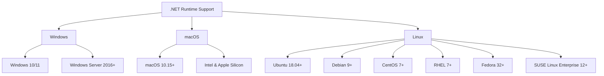
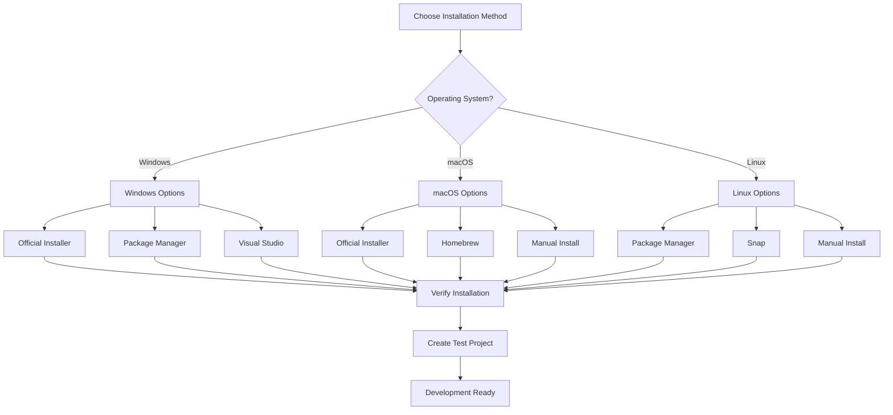

# Installing .NET on Various Operating Systems

## Overview

.NET is a cross-platform development framework that can be installed on Windows, macOS, and Linux. This guide covers installation methods for all supported operating systems, including troubleshooting common issues.

## System Requirements

### Minimum Requirements

| Component | Requirement |
|-----------|-------------|
| **OS** | Windows 10+, macOS 10.15+, or Linux |
| **RAM** | 512 MB minimum, 2 GB recommended |
| **Disk Space** | 500 MB for SDK |
| **Architecture** | x64, x86, ARM64 |

### Supported Operating Systems



## Installation Options

### .NET Runtime vs SDK

| Package | Purpose | Contains |
|---------|---------|----------|
| **.NET Runtime** | Run applications | Runtime only |
| **.NET SDK** | Develop applications | Runtime + Tools + Compilers |

**Recommendation**: Install SDK for development, Runtime for production.

## Windows Installation

### Method 1: Download from Microsoft (Recommended)

1. **Visit Official Website**
   ```
   https://dotnet.microsoft.com/download
   ```

2. **Choose Version**
   - Select latest LTS version (recommended)
   - Choose SDK for development

3. **Run Installer**
   ```powershell
   # Download and run the installer
   # Follow the installation wizard
   ```

4. **Verify Installation**
   ```powershell
   dotnet --version
   dotnet --info
   ```

### Method 2: Using Package Managers

#### Chocolatey
```powershell
# Install Chocolatey first (if not installed)
Set-ExecutionPolicy Bypass -Scope Process -Force
[System.Net.ServicePointManager]::SecurityProtocol = [System.Net.ServicePointManager]::SecurityProtocol -bor 3072
iex ((New-Object System.Net.WebClient).DownloadString('https://community.chocolatey.org/install.ps1'))

# Install .NET SDK
choco install dotnet-sdk

# Install specific version
choco install dotnet-sdk --version=8.0.0
```

#### Winget
```powershell
# Install latest SDK
winget install Microsoft.DotNet.SDK.8

# List available versions
winget search Microsoft.DotNet
```

#### Scoop
```powershell
# Install Scoop first
iwr -useb get.scoop.sh | iex

# Install .NET
scoop bucket add extras
scoop install dotnet-sdk
```

### Method 3: Visual Studio Installer

```powershell
# Visual Studio includes .NET SDK
# Select ".NET desktop development" workload
# Or "ASP.NET and web development" workload
```

## macOS Installation

### Method 1: Download from Microsoft

1. **Download Installer**
   ```bash
   # Visit: https://dotnet.microsoft.com/download
   # Select macOS installer
   # Choose Intel or Apple Silicon version
   ```

2. **Install Package**
   ```bash
   # Double-click the .pkg file
   # Follow installation wizard
   ```

3. **Verify Installation**
   ```bash
   dotnet --version
   dotnet --info
   ```

### Method 2: Using Homebrew

```bash
# Install Homebrew (if not installed)
/bin/bash -c "$(curl -fsSL https://raw.githubusercontent.com/Homebrew/install/HEAD/install.sh)"

# Install .NET SDK
brew install --cask dotnet-sdk

# Install specific version
brew install --cask dotnet-sdk@8

# Verify installation
dotnet --version
```

### Method 3: Manual Installation

```bash
# Download and extract manually
curl -sSL https://dot.net/v1/dotnet-install.sh | bash /dev/stdin --version latest

# Add to PATH (add to ~/.zshrc or ~/.bash_profile)
export DOTNET_ROOT=$HOME/.dotnet
export PATH=$PATH:$HOME/.dotnet:$HOME/.dotnet/tools
```

## Linux Installation

### Ubuntu/Debian

#### Method 1: Microsoft Repository

```bash
# Add Microsoft repository
wget https://packages.microsoft.com/config/ubuntu/22.04/packages-microsoft-prod.deb -O packages-microsoft-prod.deb
sudo dpkg -i packages-microsoft-prod.deb
rm packages-microsoft-prod.deb

# Update package index
sudo apt update

# Install .NET SDK
sudo apt install -y dotnet-sdk-8.0

# Install Runtime only
sudo apt install -y aspnetcore-runtime-8.0
```

#### Method 2: Snap Package

```bash
# Install using Snap
sudo snap install dotnet-sdk --classic --channel=8.0

# Install Runtime only
sudo snap install dotnet-runtime-80 --classic
```

#### Method 3: Manual Installation

```bash
# Download installation script
curl -sSL https://dot.net/v1/dotnet-install.sh | bash /dev/stdin --version latest

# Add to PATH
echo 'export DOTNET_ROOT=$HOME/.dotnet' >> ~/.bashrc
echo 'export PATH=$PATH:$HOME/.dotnet:$HOME/.dotnet/tools' >> ~/.bashrc
source ~/.bashrc
```

### CentOS/RHEL/Fedora

#### RHEL/CentOS 8+

```bash
# Add Microsoft repository
sudo rpm --import https://packages.microsoft.com/keys/microsoft.asc
sudo wget -O /etc/yum.repos.d/microsoft-prod.repo https://packages.microsoft.com/config/rhel/8/prod.repo

# Install .NET SDK
sudo dnf install dotnet-sdk-8.0

# Install Runtime only
sudo dnf install aspnetcore-runtime-8.0
```

#### Fedora

```bash
# Add Microsoft repository
sudo rpm --import https://packages.microsoft.com/keys/microsoft.asc
sudo wget -O /etc/yum.repos.d/microsoft-prod.repo https://packages.microsoft.com/config/fedora/37/prod.repo

# Install .NET SDK
sudo dnf install dotnet-sdk-8.0
```

### Arch Linux

```bash
# Install from AUR
yay -S dotnet-runtime dotnet-sdk

# Or using pacman (if in official repos)
sudo pacman -S dotnet-runtime dotnet-sdk
```

### Alpine Linux

```bash
# Add community repository
echo "http://dl-cdn.alpinelinux.org/alpine/edge/community" >> /etc/apk/repositories

# Update package index
apk update

# Install .NET
apk add dotnet8-sdk
```

## Docker Installation

### Using Official Docker Images

```bash
# .NET SDK image for development
docker pull mcr.microsoft.com/dotnet/sdk:8.0

# .NET Runtime image for production
docker pull mcr.microsoft.com/dotnet/runtime:8.0

# ASP.NET Core Runtime for web apps
docker pull mcr.microsoft.com/dotnet/aspnet:8.0

# Run container with SDK
docker run -it mcr.microsoft.com/dotnet/sdk:8.0
```

### Dockerfile Example

```dockerfile
# Multi-stage build example
FROM mcr.microsoft.com/dotnet/sdk:8.0 AS build
WORKDIR /app

# Copy project files
COPY *.csproj ./
RUN dotnet restore

# Copy source code and build
COPY . ./
RUN dotnet publish -c Release -o out

# Runtime stage
FROM mcr.microsoft.com/dotnet/aspnet:8.0 AS runtime
WORKDIR /app
COPY --from=build /app/out .

ENTRYPOINT ["dotnet", "MyApp.dll"]
```

## Version Management

### Installing Multiple Versions

```bash
# Install specific versions side by side
curl -sSL https://dot.net/v1/dotnet-install.sh | bash /dev/stdin --version 6.0.0
curl -sSL https://dot.net/v1/dotnet-install.sh | bash /dev/stdin --version 7.0.0
curl -sSL https://dot.net/v1/dotnet-install.sh | bash /dev/stdin --version 8.0.0

# List installed versions
dotnet --list-sdks
dotnet --list-runtimes
```

### Global.json for Project-Specific Versions

```json
{
  "sdk": {
    "version": "8.0.0",
    "rollForward": "latestMinor"
  }
}
```

## Installation Verification

### Basic Verification

```bash
# Check .NET version
dotnet --version

# Show detailed information
dotnet --info

# List installed SDKs
dotnet --list-sdks

# List installed runtimes
dotnet --list-runtimes

# Show help
dotnet --help
```

### Create Test Application

```bash
# Create new console application
dotnet new console -n TestApp
cd TestApp

# Run the application
dotnet run

# Expected output: "Hello, World!"
```

### Advanced Verification

```bash
# Check runtime information
dotnet --info

# Example output should show:
# - .NET version
# - Runtime environment
# - Host information
# - Installed workloads
```

## Troubleshooting Common Issues

### Issue 1: Permission Denied (Linux/macOS)

```bash
# Problem: Cannot install due to permissions
# Solution: Use proper installation method or fix permissions

# For manual installation
chmod +x dotnet-install.sh
./dotnet-install.sh --version latest

# Or use sudo for system-wide installation
sudo apt install dotnet-sdk-8.0
```

### Issue 2: PATH Not Set

```bash
# Problem: dotnet command not found
# Solution: Add .NET to PATH

# For bash
echo 'export PATH=$PATH:$HOME/.dotnet' >> ~/.bashrc
source ~/.bashrc

# For zsh (macOS)
echo 'export PATH=$PATH:$HOME/.dotnet' >> ~/.zshrc
source ~/.zshrc

# For fish shell
set -U fish_user_paths $HOME/.dotnet $fish_user_paths
```

### Issue 3: Certificate Issues

```bash
# Problem: SSL/TLS certificate errors
# Solution: Trust certificates

# Windows
certlm.msc  # Import certificates

# Linux
sudo apt-get update && sudo apt-get install ca-certificates

# macOS
# Certificates usually work by default
```

### Issue 4: Architecture Mismatch

```bash
# Problem: Wrong architecture installed
# Solution: Install correct version

# Check system architecture
uname -m

# Install correct version
# For ARM64: use arm64 installer
# For x64: use x64 installer
```

### Issue 5: Multiple Versions Conflict

```bash
# Problem: Multiple .NET versions causing issues
# Solution: Use global.json or remove conflicting versions

# Create global.json to specify version
echo '{"sdk":{"version":"8.0.0"}}' > global.json

# Or remove specific version
sudo rm -rf /usr/share/dotnet/sdk/7.0.0
```

## Development Environment Setup

### IDE/Editor Installation

#### Visual Studio (Windows/macOS)

```bash
# Download from: https://visualstudio.microsoft.com/
# Choose appropriate edition:
# - Community (Free)
# - Professional
# - Enterprise
```

#### Visual Studio Code (Cross-platform)

```bash
# Download from: https://code.visualstudio.com/

# Install C# extension
code --install-extension ms-dotnettools.csharp
code --install-extension ms-dotnettools.vscode-dotnet-runtime
```

#### JetBrains Rider

```bash
# Download from: https://www.jetbrains.com/rider/
# Premium IDE with excellent .NET support
```

### Additional Tools

```bash
# Entity Framework Tools
dotnet tool install --global dotnet-ef

# ASP.NET Core HTTPS development certificate
dotnet dev-certs https --trust

# User secrets for development
dotnet user-secrets init
dotnet user-secrets set "ConnectionString" "Server=..."
```

## Performance Optimization

### Ahead-of-Time (AOT) Compilation

```xml
<!-- In .csproj file -->
<PropertyGroup>
  <PublishAot>true</PublishAot>
</PropertyGroup>
```

### Ready-to-Run Images

```bash
# Publish with ReadyToRun
dotnet publish -c Release -r win-x64 --self-contained true -p:PublishReadyToRun=true
```

### Trim Unused Code

```xml
<PropertyGroup>
  <PublishTrimmed>true</PublishTrimmed>
  <TrimMode>link</TrimMode>
</PropertyGroup>
```

## Installation Flow Diagram



## Post-Installation Configuration

### Configure NuGet

```bash
# Add NuGet source
dotnet nuget add source https://api.nuget.org/v3/index.json -n nuget.org

# List configured sources
dotnet nuget list source

# Set NuGet config
dotnet nuget config
```

### Configure Development Environment

```bash
# Set default project template
dotnet new --install Microsoft.DotNet.Web.ProjectTemplates

# Configure global tools location
export DOTNET_TOOLS_PATH=$HOME/.dotnet/tools
export PATH=$PATH:$DOTNET_TOOLS_PATH
```

## Summary

| Platform | Recommended Method | Alternative Methods |
|----------|-------------------|-------------------|
| **Windows** | Official Installer | Chocolatey, Winget, Visual Studio |
| **macOS** | Homebrew | Official Installer, Manual |
| **Ubuntu/Debian** | Microsoft Repository | Snap, Manual |
| **RHEL/CentOS** | DNF Package Manager | Manual Installation |
| **Docker** | Official Images | Custom Dockerfile |

## Next Steps

After successful installation:

1. **[Learn .NET project structure](dotnet-project-structure.md)**
2. **[Master .NET CLI commands](dotnet-cli-basics.md)**
3. **[Create your first project](dotnet-first-project.md)**
4. **[Explore NuGet packages](nuget-management.md)**

Remember to always use the latest LTS version for production applications and keep your development environment updated with security patches.
