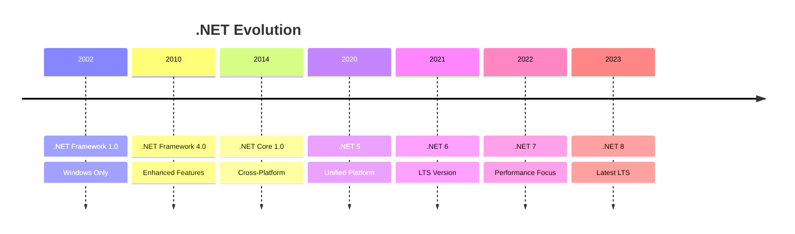
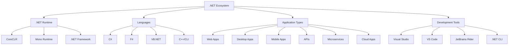
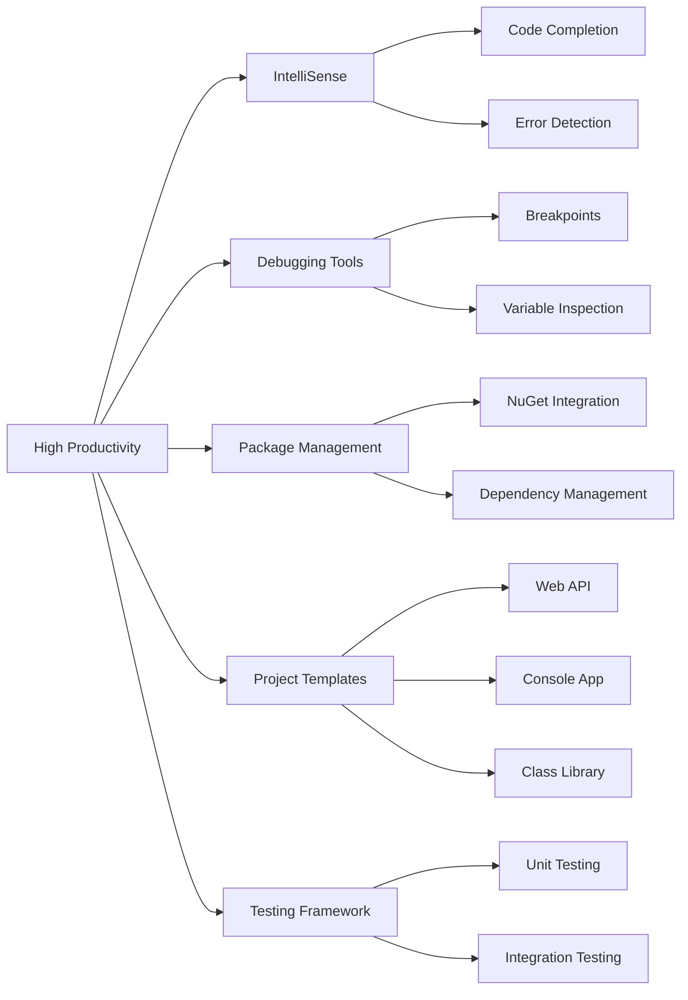
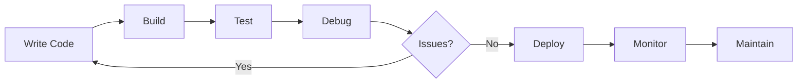
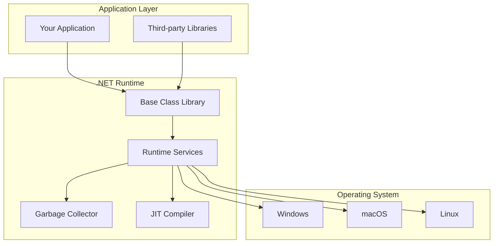
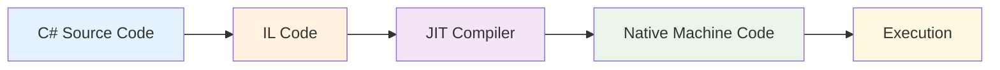

# Introduction to .NET: What and Why?

## What is .NET?

.NET is a **free, open-source, cross-platform** framework developed by Microsoft for building various types of applications. It provides a comprehensive development platform that supports multiple programming languages, libraries, and tools.

## .NET Evolution Timeline



## .NET Ecosystem Overview



## Key Components

### 1. **Runtime Environment**
The .NET runtime executes applications and provides services like:
- **Garbage Collection**: Automatic memory management
- **JIT Compilation**: Just-in-time code compilation
- **Exception Handling**: Robust error management
- **Threading**: Multi-threading support

### 2. **Base Class Library (BCL)**
Comprehensive set of classes providing:
- **Collections**: Arrays, Lists, Dictionaries
- **I/O Operations**: File and network operations
- **String Manipulation**: Text processing
- **Date/Time**: Temporal operations
- **Security**: Authentication and encryption

### 3. **Language Support**
Multiple programming languages:
- **C#**: Primary object-oriented language
- **F#**: Functional programming language
- **VB.NET**: Visual Basic for .NET
- **C++/CLI**: C++ with .NET integration

## Why Choose .NET?

### 1. **Cross-Platform Compatibility**

```
┌─────────────┬─────────────┬─────────────┐
│   Windows   │    macOS    │    Linux    │
├─────────────┼─────────────┼─────────────┤
│     ✓       │      ✓      │      ✓      │
│  Full       │   Full      │   Full      │
│  Support    │   Support   │   Support   │
└─────────────┴─────────────┴─────────────┘
```

### 2. **Performance and Scalability**

| Feature | Benefit |
|---------|---------|
| **JIT Compilation** | Optimized native code execution |
| **Garbage Collection** | Automatic memory management |
| **Async Programming** | Non-blocking operations |
| **Multi-threading** | Parallel processing support |

### 3. **Rich Ecosystem**

- **NuGet Package Manager**: 300,000+ packages
- **Extensive Documentation**: Comprehensive learning resources
- **Active Community**: Large developer community
- **Microsoft Support**: Enterprise-grade support

### 4. **Development Productivity**



## Application Types You Can Build

### 1. **Web Applications**
- **ASP.NET Core MVC**: Model-View-Controller pattern
- **Blazor**: Web UI with C#
- **ASP.NET Web API**: RESTful services
- **SignalR**: Real-time communication

```csharp
// Simple Web API Controller
[ApiController]
[Route("api/[controller]")]
public class ProductsController : ControllerBase
{
    [HttpGet]
    public IActionResult GetProducts()
    {
        return Ok(new { message = "Hello from .NET API!" });
    }
}
```

### 2. **Desktop Applications**
- **WPF**: Windows Presentation Foundation
- **WinForms**: Traditional Windows forms
- **MAUI**: Multi-platform app development
- **Avalonia**: Cross-platform UI framework

### 3. **Mobile Applications**
- **.NET MAUI**: iOS, Android, Windows
- **Xamarin**: Legacy mobile development
- **Uno Platform**: Cross-platform development

### 4. **Cloud and Microservices**
- **Azure Functions**: Serverless computing
- **Docker Containers**: Containerized applications
- **Kubernetes**: Container orchestration
- **Service Mesh**: Microservices communication

### 5. **Game Development**
- **Unity**: Popular game engine
- **MonoGame**: Cross-platform framework
- **Godot**: Open-source game engine

## .NET Versions Comparison

| Version | Release | LTS | EOL | Key Features |
|---------|---------|-----|-----|--------------|
| **.NET 8** | Nov 2023 | ✓ | Nov 2026 | Performance, Native AOT |
| **.NET 7** | Nov 2022 | ✗ | May 2024 | Performance improvements |
| **.NET 6** | Nov 2021 | ✓ | Nov 2024 | MAUI, Hot Reload |
| **.NET 5** | Nov 2020 | ✗ | May 2022 | Unified platform |
| **.NET Core 3.1** | Dec 2019 | ✓ | Dec 2022 | Windows desktop apps |

### LTS (Long Term Support) Benefits
- **3 years of support**
- **Security updates**
- **Bug fixes**
- **Production stability**

## Development Environment

### Required Tools

1. **.NET SDK**
   ```bash
   # Download from: https://dotnet.microsoft.com/download
   dotnet --version
   ```

2. **Code Editor/IDE**
   - **Visual Studio**: Full-featured IDE (Windows/Mac)
   - **Visual Studio Code**: Lightweight editor (Cross-platform)
   - **JetBrains Rider**: Premium IDE (Cross-platform)

3. **Additional Tools**
   - **Git**: Version control
   - **Docker**: Containerization
   - **Azure CLI**: Cloud deployment

### Development Workflow



## Getting Started Example

### 1. Create Your First Application

```bash
# Create new console application
dotnet new console -n MyFirstApp

# Navigate to project
cd MyFirstApp

# Run the application
dotnet run
```

### 2. Basic Program Structure

```csharp
// Program.cs
using System;

namespace MyFirstApp
{
    class Program
    {
        static void Main(string[] args)
        {
            Console.WriteLine("Hello, .NET World!");
            
            // Get user input
            Console.Write("Enter your name: ");
            string name = Console.ReadLine();
            
            // Display personalized message
            Console.WriteLine($"Hello, {name}! Welcome to .NET!");
        }
    }
}
```

### 3. Enhanced Example with Classes

```csharp
// Person.cs
public class Person
{
    public string Name { get; set; }
    public int Age { get; set; }
    
    public void Introduce()
    {
        Console.WriteLine($"Hi, I'm {Name} and I'm {Age} years old.");
    }
}

// Program.cs
using System;

class Program
{
    static void Main(string[] args)
    {
        var person = new Person 
        { 
            Name = "John Doe", 
            Age = 30 
        };
        
        person.Introduce();
    }
}
```

## .NET Architecture



## Performance Benefits

### Compilation Process



### Performance Features

1. **Just-In-Time (JIT) Compilation**
   - Optimizes code for target hardware
   - Caches compiled code for reuse

2. **Ahead-of-Time (AOT) Compilation**
   - Pre-compiled native binaries
   - Faster startup times
   - Smaller deployment size

3. **Garbage Collection**
   - Automatic memory management
   - Generational collection
   - Low-latency modes available

## Community and Support

### Learning Resources

- **Microsoft Learn**: Free interactive tutorials
- **Documentation**: Comprehensive API reference
- **GitHub**: Open-source projects and samples
- **Stack Overflow**: Community Q&A
- **YouTube**: Video tutorials and conferences

### Getting Help

```bash
# Built-in help
dotnet --help
dotnet new --help
dotnet build --help

# Community resources
# - Stack Overflow: [asp.net-core], [c#], [.net]
# - Reddit: r/dotnet, r/csharp
# - Discord: .NET Community Discord
```

## Real-World Success Stories

### Enterprise Applications
- **Stack Overflow**: High-performance Q&A platform
- **Microsoft Office**: Office 365 services
- **Stackoverflow**: Developer community platform

### E-commerce
- **GoDaddy**: Domain and hosting services
- **Alibaba**: Cloud services platform

### Financial Services
- **UBS**: Investment banking systems
- **S&P Global**: Financial data services

## Next Steps

After understanding what .NET is and its benefits:

1. **[Install .NET on your system](dotnet-installation.md)**
2. **[Learn C# programming language](csharp-basics.md)**
3. **[Understand project structure](dotnet-project-structure.md)**
4. **[Master .NET CLI commands](dotnet-cli-basics.md)**

## Summary

.NET is a powerful, versatile, and modern development platform that offers:

| Advantage | Description |
|-----------|-------------|
| **Cross-Platform** | Run on Windows, macOS, and Linux |
| **High Performance** | JIT compilation and optimizations |
| **Rich Ecosystem** | Extensive libraries and tools |
| **Developer Friendly** | Excellent tooling and documentation |
| **Enterprise Ready** | Scalable and secure applications |
| **Open Source** | Community-driven development |

Whether you're building web applications, desktop software, mobile apps, or cloud services, .NET provides the tools and framework to create robust, scalable, and maintainable applications.

The combination of performance, productivity, and platform flexibility makes .NET an excellent choice for modern software development projects of any scale.
