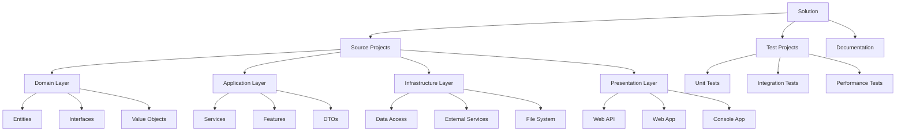

# Project and Solution Structure in .NET

## Overview

Understanding .NET project and solution structure is crucial for organizing code effectively. This guide covers the anatomy of .NET projects, solutions, and best practices for structuring applications.

## Project vs Solution

### Project
A **project** is a single compilable unit that produces one output (executable, library, etc.).

### Solution
A **solution** is a container that holds one or more related projects.

```mermaid
graph TD
    A[Solution (.sln)] --> B[Project 1 (.csproj)]
    A --> C[Project 2 (.csproj)]
    A --> D[Project 3 (.csproj)]
    
    B --> B1[Source Files]
    B --> B2[References]
    B --> B3[Resources]
    
    C --> C1[Source Files]
    C --> C2[References]
    C --> C3[Resources]
    
    D --> D1[Source Files]
    D --> D2[References]
    D --> D3[Resources]
```

## Project File Structure

### Basic Console Application Structure

```
MyConsoleApp/
├── MyConsoleApp.csproj    # Project file
├── Program.cs             # Entry point
├── appsettings.json       # Configuration (optional)
├── bin/                   # Compiled output
│   └── Debug/
│       └── net8.0/
├── obj/                   # Temporary build files
└── Properties/            # Assembly info (optional)
    └── launchSettings.json
```

### Web Application Structure

```
MyWebApp/
├── MyWebApp.csproj
├── Program.cs
├── appsettings.json
├── appsettings.Development.json
├── Controllers/
│   ├── HomeController.cs
│   └── WeatherController.cs
├── Models/
│   ├── User.cs
│   └── Product.cs
├── Views/
│   ├── Home/
│   │   ├── Index.cshtml
│   │   └── Privacy.cshtml
│   └── Shared/
│       ├── _Layout.cshtml
│       └── _ViewStart.cshtml
├── wwwroot/               # Static files
│   ├── css/
│   ├── js/
│   └── images/
├── bin/
├── obj/
└── Properties/
    └── launchSettings.json
```

### Class Library Structure

```
MyLibrary/
├── MyLibrary.csproj
├── Class1.cs
├── Interfaces/
│   └── IMyService.cs
├── Services/
│   └── MyService.cs
├── Models/
│   └── MyModel.cs
├── bin/
└── obj/
```

## Project File Anatomy (.csproj)

### Modern SDK-Style Project File

```xml
<Project Sdk="Microsoft.NET.Sdk">

  <!-- Project Properties -->
  <PropertyGroup>
    <TargetFramework>net8.0</TargetFramework>
    <OutputType>Exe</OutputType>
    <ImplicitUsings>enable</ImplicitUsings>
    <Nullable>enable</Nullable>
    <AssemblyName>MyApplication</AssemblyName>
    <RootNamespace>MyApplication</RootNamespace>
    <Version>1.0.0</Version>
    <Authors>Your Name</Authors>
    <Company>Your Company</Company>
    <Product>My Product</Product>
    <Description>Application description</Description>
  </PropertyGroup>

  <!-- Package References -->
  <ItemGroup>
    <PackageReference Include="Newtonsoft.Json" Version="13.0.3" />
    <PackageReference Include="Microsoft.Extensions.Hosting" Version="8.0.0" />
  </ItemGroup>

  <!-- Project References -->
  <ItemGroup>
    <ProjectReference Include="..\MyLibrary\MyLibrary.csproj" />
  </ItemGroup>

  <!-- Content Files -->
  <ItemGroup>
    <Content Include="appsettings.json">
      <CopyToOutputDirectory>PreserveNewest</CopyToOutputDirectory>
    </Content>
  </ItemGroup>

  <!-- Embedded Resources -->
  <ItemGroup>
    <EmbeddedResource Include="Resources\messages.json" />
  </ItemGroup>

</Project>
```

### Property Groups Explained

| Property | Description | Example |
|----------|-------------|---------|
| `TargetFramework` | .NET version to target | `net8.0`, `net6.0` |
| `OutputType` | Type of output | `Exe`, `Library`, `WinExe` |
| `ImplicitUsings` | Auto-include common namespaces | `enable`, `disable` |
| `Nullable` | Enable nullable reference types | `enable`, `warnings`, `annotations` |
| `AssemblyName` | Name of compiled assembly | `MyApp.exe` |
| `RootNamespace` | Default namespace for new files | `MyCompany.MyApp` |

### Web Application Project File

```xml
<Project Sdk="Microsoft.NET.Sdk.Web">

  <PropertyGroup>
    <TargetFramework>net8.0</TargetFramework>
    <ImplicitUsings>enable</ImplicitUsings>
    <Nullable>enable</Nullable>
  </PropertyGroup>

  <ItemGroup>
    <PackageReference Include="Microsoft.AspNetCore.Authentication.JwtBearer" Version="8.0.0" />
    <PackageReference Include="Microsoft.EntityFrameworkCore.SqlServer" Version="8.0.0" />
    <PackageReference Include="Swashbuckle.AspNetCore" Version="6.4.0" />
  </ItemGroup>

</Project>
```

## Solution Structure

### Simple Solution Structure

```
MySolution/
├── MySolution.sln
├── src/                   # Source code projects
│   ├── MyApp/
│   │   └── MyApp.csproj
│   └── MyLibrary/
│       └── MyLibrary.csproj
├── tests/                 # Test projects
│   └── MyApp.Tests/
│       └── MyApp.Tests.csproj
└── docs/                  # Documentation
    └── README.md
```

### Enterprise Solution Structure

```
EnterpriseSolution/
├── EnterpriseSolution.sln
├── src/
│   ├── Core/              # Core business logic
│   │   ├── Domain/
│   │   ├── Application/
│   │   └── Infrastructure/
│   ├── Presentation/      # UI layers
│   │   ├── WebAPI/
│   │   ├── WebApp/
│   │   └── ConsoleApp/
│   └── Shared/           # Shared libraries
│       ├── Common/
│       └── Contracts/
├── tests/
│   ├── UnitTests/
│   ├── IntegrationTests/
│   └── PerformanceTests/
├── tools/                # Build tools and scripts
├── docs/                 # Documentation
├── docker/               # Docker configurations
├── scripts/              # Build and deployment scripts
├── .gitignore
├── README.md
├── Directory.Build.props  # Shared build properties
└── Directory.Packages.props # Central package management
```

## Solution File (.sln)

### Solution File Structure

```sln
Microsoft Visual Studio Solution File, Format Version 12.00
# Visual Studio Version 17
VisualStudioVersion = 17.0.31903.59
MinimumVisualStudioVersion = 10.0.40219.1

Project("{9A19103F-16F7-4668-BE54-9A1E7A4F7556}") = "MyApp", "src\MyApp\MyApp.csproj", "{GUID-HERE}"
EndProject

Project("{9A19103F-16F7-4668-BE54-9A1E7A4F7556}") = "MyLibrary", "src\MyLibrary\MyLibrary.csproj", "{GUID-HERE}"
EndProject

Project("{2150E333-8FDC-42A3-9474-1A3956D46DE8}") = "tests", "tests", "{GUID-HERE}"
EndProject

Global
	GlobalSection(SolutionConfigurationPlatforms) = preSolution
		Debug|Any CPU = Debug|Any CPU
		Release|Any CPU = Release|Any CPU
	EndGlobalSection
	
	GlobalSection(ProjectConfigurationPlatforms) = postSolution
		{GUID-HERE}.Debug|Any CPU.ActiveCfg = Debug|Any CPU
		{GUID-HERE}.Debug|Any CPU.Build.0 = Debug|Any CPU
		{GUID-HERE}.Release|Any CPU.ActiveCfg = Release|Any CPU
		{GUID-HERE}.Release|Any CPU.Build.0 = Release|Any CPU
	EndGlobalSection
EndGlobal
```

## Directory Structure Best Practices

### Clean Architecture Structure

```
CleanArchitecture/
├── CleanArchitecture.sln
├── src/
│   ├── Domain/                    # Core business entities
│   │   ├── Domain.csproj
│   │   ├── Entities/
│   │   ├── Enums/
│   │   ├── Exceptions/
│   │   ├── Interfaces/
│   │   └── ValueObjects/
│   ├── Application/               # Business logic
│   │   ├── Application.csproj
│   │   ├── Common/
│   │   ├── Features/
│   │   ├── Interfaces/
│   │   └── Services/
│   ├── Infrastructure/            # External dependencies
│   │   ├── Infrastructure.csproj
│   │   ├── Data/
│   │   ├── Services/
│   │   └── Repositories/
│   └── Presentation/              # UI layer
│       ├── WebAPI/
│       └── WebApp/
├── tests/
│   ├── Domain.Tests/
│   ├── Application.Tests/
│   ├── Infrastructure.Tests/
│   └── Integration.Tests/
└── tools/
    └── BuildTools/
```

### Microservices Structure

```
MicroservicesApp/
├── MicroservicesApp.sln
├── src/
│   ├── Services/
│   │   ├── UserService/
│   │   │   ├── UserService.API/
│   │   │   ├── UserService.Domain/
│   │   │   ├── UserService.Infrastructure/
│   │   │   └── UserService.Tests/
│   │   ├── OrderService/
│   │   │   ├── OrderService.API/
│   │   │   ├── OrderService.Domain/
│   │   │   ├── OrderService.Infrastructure/
│   │   │   └── OrderService.Tests/
│   │   └── PaymentService/
│   ├── Shared/
│   │   ├── Common/
│   │   ├── Events/
│   │   └── Contracts/
│   └── Gateway/
│       └── ApiGateway/
├── tests/
│   ├── IntegrationTests/
│   └── LoadTests/
├── docker/
│   ├── docker-compose.yml
│   └── Dockerfile
└── k8s/                          # Kubernetes manifests
    ├── deployments/
    └── services/
```

## Configuration Files

### appsettings.json

```json
{
  "Logging": {
    "LogLevel": {
      "Default": "Information",
      "Microsoft.AspNetCore": "Warning"
    }
  },
  "ConnectionStrings": {
    "DefaultConnection": "Server=localhost;Database=MyApp;Trusted_Connection=true;",
    "Redis": "localhost:6379"
  },
  "AppSettings": {
    "JwtSecret": "your-secret-key",
    "TokenExpirationMinutes": 60,
    "EnableSwagger": true
  },
  "ExternalApis": {
    "PaymentGateway": {
      "BaseUrl": "https://api.payment.com",
      "ApiKey": "your-api-key"
    }
  }
}
```

### launchSettings.json

```json
{
  "profiles": {
    "Development": {
      "commandName": "Project",
      "dotnetRunMessages": true,
      "launchBrowser": true,
      "applicationUrl": "https://localhost:7001;http://localhost:5001",
      "environmentVariables": {
        "ASPNETCORE_ENVIRONMENT": "Development"
      }
    },
    "Production": {
      "commandName": "Project",
      "launchBrowser": false,
      "applicationUrl": "https://localhost:443;http://localhost:80",
      "environmentVariables": {
        "ASPNETCORE_ENVIRONMENT": "Production"
      }
    }
  }
}
```

## Working with Projects and Solutions

### Creating Projects and Solutions

```bash
# Create new solution
dotnet new sln -n MySolution

# Create projects
dotnet new console -n MyConsoleApp
dotnet new webapi -n MyWebAPI
dotnet new classlib -n MyLibrary
dotnet new xunit -n MyLibrary.Tests

# Add projects to solution
dotnet sln add MyConsoleApp/MyConsoleApp.csproj
dotnet sln add MyWebAPI/MyWebAPI.csproj
dotnet sln add MyLibrary/MyLibrary.csproj
dotnet sln add MyLibrary.Tests/MyLibrary.Tests.csproj

# Add project references
dotnet add MyConsoleApp/MyConsoleApp.csproj reference MyLibrary/MyLibrary.csproj
dotnet add MyLibrary.Tests/MyLibrary.Tests.csproj reference MyLibrary/MyLibrary.csproj
```

### Building Projects and Solutions

```bash
# Build entire solution
dotnet build

# Build specific project
dotnet build MyWebAPI/MyWebAPI.csproj

# Build in Release mode
dotnet build -c Release

# Restore packages
dotnet restore

# Clean solution
dotnet clean
```

## Build Configuration

### Directory.Build.props

```xml
<Project>
  <!-- Global properties for all projects -->
  <PropertyGroup>
    <LangVersion>latest</LangVersion>
    <TreatWarningsAsErrors>true</TreatWarningsAsErrors>
    <WarningsAsErrors />
    <WarningsNotAsErrors>CS1591</WarningsNotAsErrors>
    <Version>1.0.0</Version>
    <Company>My Company</Company>
    <Product>My Product</Product>
    <Copyright>Copyright © My Company 2024</Copyright>
  </PropertyGroup>

  <!-- Global package references -->
  <ItemGroup>
    <PackageReference Include="Microsoft.CodeAnalysis.Analyzers" Version="3.3.4" PrivateAssets="all" />
    <PackageReference Include="StyleCop.Analyzers" Version="1.1.118" PrivateAssets="all" />
  </ItemGroup>
</Project>
```

### Directory.Packages.props

```xml
<Project>
  <PropertyGroup>
    <ManagePackageVersionsCentrally>true</ManagePackageVersionsCentrally>
  </PropertyGroup>

  <ItemGroup>
    <PackageVersion Include="Microsoft.Extensions.Hosting" Version="8.0.0" />
    <PackageVersion Include="Microsoft.Extensions.DependencyInjection" Version="8.0.0" />
    <PackageVersion Include="Newtonsoft.Json" Version="13.0.3" />
    <PackageVersion Include="Serilog" Version="3.1.1" />
    <PackageVersion Include="xunit" Version="2.4.2" />
    <PackageVersion Include="Microsoft.NET.Test.Sdk" Version="17.8.0" />
  </ItemGroup>
</Project>
```

## File and Folder Naming Conventions

### C# Naming Conventions

| Element | Convention | Example |
|---------|------------|---------|
| **Namespace** | PascalCase | `MyCompany.MyProduct.MyModule` |
| **Class** | PascalCase | `UserService`, `ProductController` |
| **Interface** | I + PascalCase | `IUserService`, `IRepository<T>` |
| **Method** | PascalCase | `GetUser()`, `CreateProduct()` |
| **Property** | PascalCase | `UserName`, `CreatedDate` |
| **Field (private)** | _camelCase | `_userName`, `_createdDate` |
| **Variable** | camelCase | `userName`, `productList` |
| **Constant** | PascalCase | `MaxRetryCount`, `DefaultTimeout` |

### File and Folder Conventions

```
Project/
├── Controllers/           # PascalCase for folders
│   ├── UserController.cs  # Controller suffix
│   └── ProductController.cs
├── Services/
│   ├── IUserService.cs    # Interface with I prefix
│   └── UserService.cs     # Implementation
├── Models/
│   ├── User.cs           # Entity/Model names
│   └── CreateUserRequest.cs # Descriptive names
├── Repositories/
│   ├── IUserRepository.cs
│   └── UserRepository.cs
└── Extensions/
    └── StringExtensions.cs # Extensions suffix
```

## Project Templates

### Custom Project Template

```bash
# Install template
dotnet new install MyCompany.ProjectTemplates

# Create project from template
dotnet new mytemplate -n MyNewProject

# List available templates
dotnet new list
```

### Creating Custom Template

```
MyTemplate/
├── .template.config/
│   └── template.json
├── MyTemplate.csproj
├── Program.cs
└── README.md
```

```json
{
  "$schema": "http://json.schemastore.org/template",
  "author": "Your Name",
  "classifications": ["Web", "API"],
  "identity": "MyCompany.WebAPI.Template",
  "name": "My Web API Template",
  "shortName": "mywebapi",
  "tags": {
    "language": "C#",
    "type": "project"
  },
  "sourceName": "MyTemplate",
  "preferNameDirectory": true
}
```

## Best Practices

### Project Organization

1. **Separate Concerns**
   - Keep business logic separate from UI
   - Use layers (Domain, Application, Infrastructure)

2. **Consistent Naming**
   - Follow C# naming conventions
   - Use descriptive names

3. **Project Dependencies**
   - Avoid circular references
   - Keep dependencies minimal
   - Use interfaces for loose coupling

### Solution Organization

1. **Logical Grouping**
   ```
   src/           # Source code
   tests/         # Test projects
   tools/         # Build tools
   docs/          # Documentation
   samples/       # Example code
   ```

2. **Multiple Solutions**
   - For large codebases
   - Group related projects
   - Maintain build performance

### File Organization

1. **One Class Per File**
2. **Match File Name to Class Name**
3. **Group Related Files in Folders**
4. **Use Partial Classes When Appropriate**

## Project Structure Visualization



## Next Steps

After understanding project structure:

1. **[Learn .NET CLI commands](dotnet-cli-basics.md)**
2. **[Create your first project](dotnet-first-project.md)**
3. **[Explore NuGet package management](nuget-management.md)**
4. **[Understand dependency injection](dotnet-dependency-injection.md)**

Understanding proper project and solution structure is fundamental to building maintainable, scalable .NET applications. Start with simple structures and evolve them as your applications grow in complexity.
