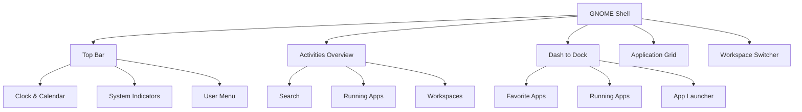
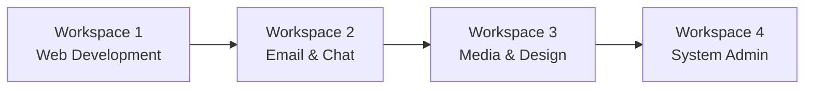

# Getting to Know Desktop Environment in Ubuntu

## Overview

Ubuntu's desktop environment is your gateway to interacting with the system. Understanding the desktop environment helps you navigate efficiently, customize your workspace, and maximize productivity. This guide covers GNOME (Ubuntu's default) and other popular alternatives.

## Ubuntu Desktop Environment (GNOME)

### What is GNOME?

GNOME (GNU Network Object Model Environment) is Ubuntu's default desktop environment since version 17.10. It provides a modern, clean, and user-friendly interface designed for productivity and ease of use.

### GNOME Shell Architecture



## Desktop Components

### 1. Top Bar (Panel)

The top bar spans the full width of your screen and contains:

```
┌─────────────────────────────────────────────────────────────┐
│ Activities  ⏰ Mon 15:30  📶 🔊 🔋 ⚙️ 👤                  │
└─────────────────────────────────────────────────────────────┘
```

#### Left Side: Activities Button
- Click to open Activities Overview
- Search for applications and files
- Switch between workspaces

#### Center: Clock and Calendar
- Shows current time and date
- Click to view calendar
- Displays notifications and events

#### Right Side: System Indicators
- **Network**: Wi-Fi, Ethernet, VPN status
- **Audio**: Volume control and output selection
- **Battery**: Power level and settings (laptops)
- **Settings**: Quick settings menu
- **User Menu**: Account options and power controls

### 2. Activities Overview

Press `Super` key or click "Activities" to access:

```
┌─────────────────────────────────────────────────────────────┐
│                        🔍 Search                            │
├─────────────────────────────────────────────────────────────┤
│  🖥️     📁     🌐     ✉️      📝     🎵                    │
│ Apps   Files Firefox Thunderbird Text   Music              │
├─────────────────────────────────────────────────────────────┤
│                                                 │ Workspace │
│          Active Application Windows             │     1     │
│                                                 ├───────────┤
│                                                 │ Workspace │
│                                                 │     2     │
└─────────────────────────────────────────────────┴───────────┘
```

#### Features:
- **Universal Search**: Find apps, files, settings
- **Application Grid**: Browse all installed applications
- **Running Applications**: Switch between open windows
- **Workspaces**: Organize applications across virtual desktops

### 3. Dock (Ubuntu Dock)

The left sidebar shows:

```
┌─┐
│📁│ Files
├─┤
│🌐│ Firefox
├─┤
│⚙️│ Settings
├─┤
│📧│ Thunderbird
├─┤
│🗑️│ Trash
└─┘
```

#### Functions:
- **Launch Applications**: Click to open
- **Switch Windows**: Click running app to switch
- **Indicators**: Dots show running applications
- **Drag & Drop**: Organize and add favorites

### 4. Application Menu

Access all applications via:

```
┌─────────────────────────────────────────┐
│  📱 All Applications                    │
├─────────────────────────────────────────┤
│ 🎨 Graphics    📊 Office    🔧 System  │
│ 🌐 Internet    🎵 Media     🔬 Science │
│ 🎮 Games       📚 Education 🛠️ Dev    │
└─────────────────────────────────────────┘
```

## Workspaces and Window Management

### Understanding Workspaces

Workspaces are virtual desktops that help organize your work:



### Workspace Management

```bash
# Keyboard shortcuts for workspaces
Super + Page Up     # Move to workspace above
Super + Page Down   # Move to workspace below
Ctrl + Alt + Up     # Switch to workspace above
Ctrl + Alt + Down   # Switch to workspace below

# Move windows between workspaces
Super + Shift + Page Up    # Move window to workspace above
Super + Shift + Page Down  # Move window to workspace below
```

### Window Management

#### Tiling and Snapping

```bash
# Window tiling shortcuts
Super + Left   # Snap window to left half
Super + Right  # Snap window to right half
Super + Up     # Maximize window
Super + Down   # Restore/minimize window

# Advanced tiling
Super + H      # Hide window
Alt + F4       # Close window
Alt + F10      # Maximize/restore toggle
```

#### Window Switching

```bash
# Application switching
Alt + Tab              # Switch between applications
Alt + Shift + Tab      # Reverse application switching
Alt + `                # Switch between windows of same app
Super + Tab            # Switch between applications on all workspaces
```

## Customizing the Desktop Environment

### Using GNOME Settings

Access settings via: `Settings` app or `gnome-control-center`

#### Appearance Settings

```bash
# Change theme and appearance
Settings → Appearance
- Style: Light/Dark mode
- Wallpaper: Background images
- Desktop Icons: Show/hide desktop icons
```

#### Desktop Behavior

```bash
# Customize desktop behavior
Settings → Desktop
- Auto Hide Dock: Show/hide dock automatically
- Dock Position: Left, Bottom, Right
- Icon Size: Small, Medium, Large
```

### GNOME Extensions

Extensions add functionality to GNOME Shell:

#### Installing Extensions

```bash
# Method 1: Browser extension
# Visit: https://extensions.gnome.org/
# Install browser extension
# Browse and install GNOME extensions

# Method 2: Package manager
sudo apt install gnome-shell-extensions
sudo apt install gnome-shell-extension-manager

# Method 3: Manual installation
# Download .zip file
gnome-extensions install extension.zip
```

#### Popular Extensions

```bash
# Essential extensions
- Dash to Panel: Windows-style taskbar
- AppIndicator Support: System tray support
- Workspace Indicator: Workspace numbers in top bar
- User Themes: Custom theme support
- Clipboard Indicator: Clipboard history
- Weather: Weather in top bar
- Vitals: System monitoring
```

#### Managing Extensions

```bash
# Command line management
gnome-extensions list                    # List installed extensions
gnome-extensions enable extension-name   # Enable extension
gnome-extensions disable extension-name  # Disable extension
gnome-extensions reset extension-name    # Reset extension settings

# GUI management
gnome-extensions-app  # Extensions app
```

### Keyboard Shortcuts

#### Essential Shortcuts

| Shortcut | Action |
|----------|--------|
| `Super` | Open Activities Overview |
| `Super + A` | Show applications grid |
| `Super + L` | Lock screen |
| `Super + D` | Show desktop |
| `Alt + F2` | Run command dialog |
| `Ctrl + Alt + T` | Open terminal |
| `Print Screen` | Take screenshot |

#### Window Management

| Shortcut | Action |
|----------|--------|
| `Super + M` | Open notification list |
| `Super + V` | Show notification list |
| `Alt + Space` | Window menu |
| `Alt + F4` | Close window |
| `Alt + F10` | Maximize/restore window |

#### Customizing Shortcuts

```bash
# Access keyboard shortcuts
Settings → Keyboard → Keyboard Shortcuts

# Categories:
- Navigation: Workspace and window switching
- Windows: Window management
- System: System functions
- Custom: User-defined shortcuts
```

## Alternative Desktop Environments

### KDE Plasma (Kubuntu)

#### Installation

```bash
# Install KDE Plasma
sudo apt update
sudo apt install kubuntu-desktop

# Switch session at login screen
# Select "Plasma" session
```

#### Features

```
KDE Plasma Features:
├── Highly Customizable Interface
├── Advanced Window Management
├── Integrated Applications (Konqueror, Dolphin)
├── Widgets and Plasmoids
├── Multiple Panel Layouts
└── Advanced System Settings
```

### Xfce (Xubuntu)

#### Installation

```bash
# Install Xfce
sudo apt update
sudo apt install xubuntu-desktop

# Lightweight and fast
# Good for older hardware
```

#### Characteristics

- **Lightweight**: Low resource usage
- **Traditional**: Classic desktop metaphor
- **Customizable**: Flexible layout options
- **Stable**: Reliable and proven

### LXQt (Lubuntu)

#### Installation

```bash
# Install LXQt
sudo apt update
sudo apt install lubuntu-desktop

# Very lightweight
# Minimal resource usage
```

### MATE (Ubuntu MATE)

#### Installation

```bash
# Install MATE
sudo apt update
sudo apt install ubuntu-mate-desktop

# Traditional GNOME 2 experience
# Familiar interface for long-time users
```

## File Manager (Nautilus)

### Basic Navigation

```
Nautilus Interface:
┌─────────────────────────────────────────────────────┐
│ ← → ↑ Home Documents Pictures Music Videos Downloads │
├─────────────────────────────────────────────────────┤
│ Sidebar   │           Main View                     │
│           │                                         │
│ Places    │  📁 folder1    📄 document.txt         │
│ Bookmarks │  📁 folder2    🖼️ image.jpg            │
│ Devices   │  📁 folder3    🎵 song.mp3             │
│           │                                         │
└───────────┴─────────────────────────────────────────┘
```

### File Operations

```bash
# Keyboard shortcuts in Files
Ctrl + N         # New window
Ctrl + T         # New tab
Ctrl + W         # Close tab
Ctrl + L         # Address bar
Ctrl + H         # Show hidden files
F9               # Toggle sidebar
Ctrl + 1/2/3     # Change view (icons/list/compact)
Space            # Preview file
```

### Bookmarks and Places

```bash
# Default places
- Home: User home directory
- Desktop: Desktop folder
- Documents: Documents folder
- Downloads: Download folder
- Music: Music folder
- Pictures: Pictures folder
- Videos: Videos folder
- Computer: System drives
- Network: Network locations
```

## Application Launcher and Management

### Application Categories

```
Application Categories:
├── Accessories (Utilities)
├── Games
├── Graphics
├── Internet
├── Office
├── Programming
├── Sound & Video
├── System Tools
└── Universal Access
```

### Installing Applications

#### Ubuntu Software Center

```bash
# Launch Ubuntu Software
ubuntu-software

# Or from command line
snap-store

# Features:
- Browse by category
- Search applications
- Read reviews and ratings
- Install/remove software
- Manage updates
```

#### Command Line Installation

```bash
# APT packages
sudo apt update
sudo apt install application-name

# Snap packages
sudo snap install application-name

# Flatpak packages
flatpak install flathub application-id
```

## Notifications and System Tray

### Notification System

```
Notification Area:
┌─────────────────────────────────────┐
│ 📧 New Email from John              │
│ 📱 System Update Available          │
│ 🔔 Calendar: Meeting in 15 minutes  │
└─────────────────────────────────────┘
```

### Managing Notifications

```bash
# Access notification settings
Settings → Notifications

# Options:
- Do Not Disturb: Silence notifications
- Application notifications: Per-app settings
- Lock screen notifications: Show/hide on lock screen
```

## Accessibility Features

### Visual Accessibility

```bash
# Access accessibility settings
Settings → Accessibility

# Visual options:
- High Contrast: Enhanced visibility
- Large Text: Increased font size
- Magnifier: Screen magnification
- Screen Reader: Orca screen reader
- Sound Keys: Audio feedback for typing
```

### Motor Accessibility

```bash
# Motor accessibility features:
- Sticky Keys: Modifier key assistance
- Slow Keys: Typing assistance
- Bounce Keys: Repeat key filtering
- Mouse Keys: Keyboard mouse control
- Click Assist: Click timing assistance
```

## Performance and Optimization

### System Monitoring

```bash
# Check system resources
gnome-system-monitor  # GUI system monitor
htop                 # Terminal system monitor

# GNOME usage monitoring
gnome-usage          # Disk and system usage
```

### Optimizing Performance

```bash
# Disable unnecessary extensions
gnome-extensions disable extension-name

# Reduce animations
gsettings set org.gnome.desktop.interface enable-animations false

# Limit background applications
# Use System Monitor to identify resource-heavy processes
```

## Troubleshooting Desktop Issues

### Common Problems

#### Desktop Not Loading

```bash
# Reset GNOME settings
dconf reset -f /org/gnome/

# Restart GNOME Shell
Alt + F2 → type "r" → Enter

# Reinstall GNOME packages
sudo apt install --reinstall ubuntu-desktop-minimal
```

#### Extensions Not Working

```bash
# Reload extensions
gnome-extensions list
gnome-extensions reset extension-name

# Check compatibility
gnome-shell --version
# Ensure extensions support your GNOME version
```

#### Performance Issues

```bash
# Check graphics drivers
ubuntu-drivers devices
sudo ubuntu-drivers autoinstall

# Reduce visual effects
gsettings set org.gnome.desktop.interface enable-animations false

# Monitor resource usage
gnome-system-monitor
```

## Customization Examples

### Theme Customization

```bash
# Install GNOME Tweaks
sudo apt install gnome-tweaks

# Custom themes location
~/.themes/          # User themes
/usr/share/themes/  # System themes

# Apply custom theme
gnome-tweaks → Appearance → Themes
```

### Icon Customization

```bash
# Icon themes location
~/.icons/          # User icons
/usr/share/icons/  # System icons

# Popular icon themes
sudo apt install papirus-icon-theme
sudo apt install numix-icon-theme
```

### Wallpaper Management

```bash
# Wallpaper locations
~/Pictures/                    # User wallpapers
/usr/share/backgrounds/        # System wallpapers

# Set wallpaper via command line
gsettings set org.gnome.desktop.background picture-uri file:///path/to/image.jpg
```

## Desktop Environment Comparison

| Feature | GNOME | KDE Plasma | Xfce | LXQt |
|---------|-------|------------|------|------|
| **Resource Usage** | Medium | Medium-High | Low | Very Low |
| **Customization** | Limited | Extensive | Good | Moderate |
| **Modern Design** | Excellent | Excellent | Traditional | Simple |
| **Touch Support** | Good | Excellent | Limited | Limited |
| **Learning Curve** | Easy | Moderate | Easy | Easy |

## Best Practices

### Workflow Optimization

1. **Use Workspaces**: Organize different tasks
2. **Master Shortcuts**: Learn essential keyboard shortcuts
3. **Customize Dock**: Add frequently used applications
4. **Configure Notifications**: Minimize distractions
5. **Regular Maintenance**: Keep system updated

### Security Considerations

```bash
# Lock screen automatically
Settings → Privacy → Screen Lock
- Automatic Screen Lock: ON
- Lock Screen Delay: 5 minutes

# Disable guest session
sudo sh -c 'printf "[Seat:*]\nallow-guest=false\n" >/etc/lightdm/lightdm.conf.d/50-no-guest.conf'
```

## Next Steps

After mastering the desktop environment:

1. **[Learn file and folder management](ubuntu-file-folder-management.md)**
2. **[Master user and permissions](ubuntu-user-permissions.md)**
3. **[Explore system customization](ubuntu-interface-customization.md)**
4. **[Set up development environment](ubuntu-software-development.md)**

## Summary

Ubuntu's desktop environment provides:

| Component | Purpose | Key Features |
|-----------|---------|--------------|
| **GNOME Shell** | Main interface | Activities overview, search, workspaces |
| **Top Bar** | System status | Clock, indicators, user menu |
| **Dock** | App launcher | Favorites, running apps, quick access |
| **File Manager** | File operations | Browse, search, organize files |
| **Extensions** | Extended functionality | Customization and additional features |

Understanding these components enables you to work efficiently and customize Ubuntu to match your workflow preferences.
