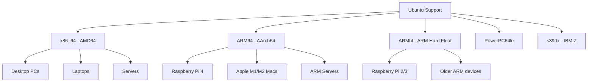
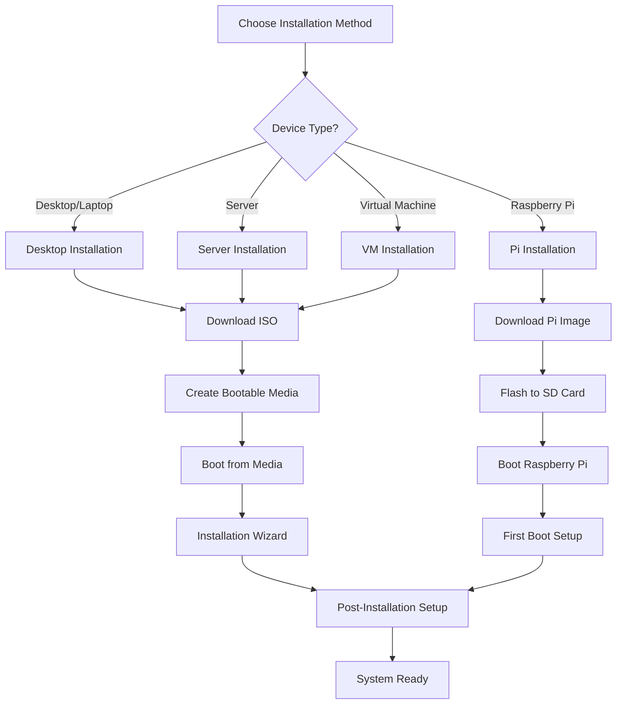

# Installing Ubuntu on Various Devices

## Overview

Ubuntu can be installed on a wide variety of devices, from desktop computers to servers, virtual machines, and even single-board computers. This comprehensive guide covers all installation methods and scenarios.

## System Requirements

### Minimum Requirements

| Component | Requirement | Recommended |
|-----------|-------------|-------------|
| **RAM** | 4 GB | 8 GB or more |
| **Storage** | 25 GB | 50 GB or more |
| **Processor** | 2 GHz dual-core | 2 GHz quad-core |
| **Graphics** | VGA capable of 1024x768 | 1920x1080 or higher |
| **Network** | Internet connection | Ethernet or Wi-Fi |
| **Boot** | UEFI or BIOS | UEFI with Secure Boot |

### Supported Architectures



## Pre-Installation Preparation

### 1. Backup Important Data

```bash
# Create backup of important files
rsync -av /home/username/Documents/ /backup/Documents/
rsync -av /home/username/Pictures/ /backup/Pictures/

# Or use GUI tools like:
# - Déjà Dup (built-in backup tool)
# - rsync with GUI (Grsync)
# - Commercial solutions (Carbonite, etc.)
```

### 2. Check Hardware Compatibility

```bash
# Check if your hardware is compatible
# Visit: https://certification.ubuntu.com/

# Test Ubuntu without installing (Live USB)
# This helps identify potential hardware issues
```

### 3. Gather System Information

```bash
# Before installation, note:
# - Current OS and version
# - Partition layout (fdisk -l or Disk Utility)
# - Network settings
# - Installed software list
```

## Installation Methods

### Method 1: Desktop Installation (Most Common)

#### Step 1: Download Ubuntu

```bash
# Visit official website
https://ubuntu.com/download/desktop

# Choose version:
# - Latest LTS (recommended for stability)
# - Latest version (for newest features)

# Verify download (optional but recommended)
sha256sum ubuntu-22.04.3-desktop-amd64.iso
```

#### Step 2: Create Installation Media

##### Using USB Drive (Recommended)

**Windows:**
```powershell
# Using Rufus
1. Download Rufus from https://rufus.ie/
2. Insert USB drive (8GB or larger)
3. Select Ubuntu ISO file
4. Choose GPT partition scheme for UEFI
5. Click "Start"

# Using Balena Etcher
1. Download from https://www.balena.io/etcher/
2. Select ISO file
3. Select USB drive
4. Flash!
```

**macOS:**
```bash
# Using built-in tools
diskutil list
diskutil unmountDisk /dev/diskN
sudo dd if=ubuntu-22.04.3-desktop-amd64.iso of=/dev/rdiskN bs=1m

# Or use Balena Etcher (GUI method)
```

**Linux:**
```bash
# Find USB device
lsblk

# Create bootable USB
sudo dd bs=4M if=ubuntu-22.04.3-desktop-amd64.iso of=/dev/sdX status=progress oflag=sync

# Or use USB Creator
usb-creator-gtk
```

#### Step 3: Boot from USB

1. **Insert USB drive**
2. **Restart computer**
3. **Enter BIOS/UEFI settings** (usually F2, F12, DEL, or ESC)
4. **Change boot order** to USB first
5. **Save and exit**

#### Step 4: Installation Process

```
Ubuntu Installation Steps:
├── 1. Language Selection
├── 2. Keyboard Layout
├── 3. Network Connection
├── 4. Updates and Software
│   ├── Normal installation (recommended)
│   ├── Minimal installation
│   └── Download updates while installing
├── 5. Installation Type
│   ├── Erase disk and install Ubuntu
│   ├── Install alongside existing OS
│   ├── Something else (manual partitioning)
│   └── Encrypt the new Ubuntu installation
├── 6. Location/Timezone
├── 7. User Account Creation
└── 8. Installation Progress
```

### Method 2: Server Installation

#### Download Ubuntu Server

```bash
# Download from
https://ubuntu.com/download/server

# Server benefits:
# - No GUI by default (lighter)
# - Optimized for server workloads
# - More configuration options
```

#### Server Installation Process

```bash
# Boot from installation media
# Follow these steps:

1. Language and keyboard selection
2. Network configuration
   - Configure static IP if needed
   - Set up proxy if required
3. Storage configuration
   - Guided storage (automatic)
   - Manual partitioning
   - LVM setup
   - RAID configuration
4. Profile setup
   - User account creation
   - SSH server installation
5. Package selection
   - Docker
   - Kubernetes
   - PostgreSQL
   - etc.
```

### Method 3: Virtual Machine Installation

#### VMware Workstation/Player

```bash
# VM Configuration:
# - Memory: 4GB minimum, 8GB recommended
# - Storage: 25GB minimum, 50GB recommended
# - Network: NAT or Bridged
# - Enable virtualization features

# Installation steps:
1. Create new VM
2. Select Linux > Ubuntu 64-bit
3. Allocate resources
4. Mount Ubuntu ISO
5. Follow standard installation
```

#### VirtualBox

```bash
# VM Setup:
# - Type: Linux
# - Version: Ubuntu (64-bit)
# - Memory: 4096 MB minimum
# - Hard disk: 25 GB minimum

# Enable features:
# - VT-x/AMD-V virtualization
# - PAE/NX
# - Hardware acceleration
```

#### Hyper-V (Windows)

```powershell
# Enable Hyper-V
Enable-WindowsOptionalFeature -Online -FeatureName Microsoft-Hyper-V -All

# Create VM
New-VM -Name "Ubuntu" -MemoryStartupBytes 4GB -NewVHDPath "C:\VMs\Ubuntu.vhdx" -NewVHDSizeBytes 50GB

# Configure VM
Set-VMProcessor -VMName "Ubuntu" -Count 2
Add-VMNetworkAdapter -VMName "Ubuntu"
```

### Method 4: Dual Boot Installation

#### Pre-Installation Steps

```bash
# 1. Shrink existing partition
# Windows: Use Disk Management
# macOS: Use Disk Utility
# Linux: Use GParted

# 2. Disable Fast Startup (Windows)
# Control Panel > Power Options > Choose what power buttons do
# Uncheck "Turn on fast startup"

# 3. Disable Secure Boot (if needed)
# Enter UEFI settings
# Find Secure Boot option
# Disable temporarily
```

#### Dual Boot Setup

```
Partition Layout Example:
├── /dev/sda1 - EFI System Partition (512MB)
├── /dev/sda2 - Windows (C:) - 200GB
├── /dev/sda3 - Ubuntu Root (/) - 30GB
├── /dev/sda4 - Ubuntu Home (/home) - 50GB
└── /dev/sda5 - Swap - 8GB
```

#### GRUB Configuration

```bash
# After installation, GRUB will detect Windows
# If Windows doesn't appear:
sudo update-grub

# Customize GRUB timeout
sudo nano /etc/default/grub
# GRUB_TIMEOUT=10
sudo update-grub

# Set default OS
# GRUB_DEFAULT=0  # Ubuntu
# GRUB_DEFAULT=2  # Windows (usually)
```

## Special Installation Scenarios

### Installation on Apple Silicon Macs

#### Asahi Linux (Experimental)

```bash
# Note: This is experimental and may not be stable
# Visit: https://asahilinux.org/

# Requirements:
# - macOS 12.3 or later
# - At least 53GB free space
# - Internet connection

# Installation:
curl https://alx.sh | sh
```

#### UTM Virtual Machine

```bash
# Alternative: Run Ubuntu in UTM
# 1. Install UTM from App Store
# 2. Download Ubuntu ARM64 ISO
# 3. Create new VM with ARM64 architecture
# 4. Follow standard installation
```

### Raspberry Pi Installation

#### Raspberry Pi 4/5

```bash
# Download Ubuntu for Raspberry Pi
https://ubuntu.com/download/raspberry-pi

# Flash to microSD card
# Use Raspberry Pi Imager or dd command

# First boot setup:
# 1. Connect monitor, keyboard, mouse
# 2. Connect to network
# 3. Follow setup wizard
# 4. Enable SSH if needed
```

#### Post-Installation Configuration

```bash
# Update system
sudo apt update && sudo apt upgrade

# Enable SSH
sudo systemctl enable ssh
sudo systemctl start ssh

# Configure GPU memory split
sudo raspi-config
# Advanced Options > Memory Split > 16 (headless) or 64 (desktop)

# Enable camera (if connected)
sudo raspi-config
# Interface Options > Camera > Enable
```

### Network Installation (PXE Boot)

#### PXE Server Setup

```bash
# Install TFTP and DHCP server
sudo apt install tftpd-hpa isc-dhcp-server

# Configure DHCP
sudo nano /etc/dhcp/dhcpd.conf
# Add PXE boot configuration

# Setup netboot files
cd /var/lib/tftpboot
sudo wget http://archive.ubuntu.com/ubuntu/dists/jammy/main/installer-amd64/current/legacy-images/netboot/netboot.tar.gz
sudo tar -xzf netboot.tar.gz
```

### Automated Installation (Preseed)

#### Create Preseed File

```bash
# preseed.cfg example
d-i debian-installer/language string en
d-i debian-installer/country string US
d-i debian-installer/locale string en_US.UTF-8

# Keyboard
d-i console-setup/ask_detect boolean false
d-i keyboard-configuration/xkb-keymap select us

# Network
d-i netcfg/choose_interface select auto
d-i netcfg/get_hostname string ubuntu-auto

# User account
d-i passwd/user-fullname string Ubuntu User
d-i passwd/username string ubuntu
d-i passwd/user-password password ubuntu
d-i passwd/user-password-again password ubuntu

# Partitioning
d-i partman-auto/method string regular
d-i partman-auto/choose_recipe select atomic
d-i partman/confirm boolean true
d-i partman/confirm_nooverwrite boolean true

# Software selection
tasksel tasksel/first multiselect ubuntu-desktop
d-i pkgsel/include string openssh-server

# GRUB
d-i grub-installer/only_debian boolean true
d-i grub-installer/with_other_os boolean true

# Finish
d-i finish-install/reboot_in_progress note
```

## Post-Installation Setup

### Essential First Steps

```bash
# Update system
sudo apt update && sudo apt upgrade

# Install essential packages
sudo apt install curl wget git vim htop tree

# Install media codecs
sudo apt install ubuntu-restricted-extras

# Install additional drivers
sudo ubuntu-drivers autoinstall

# Configure firewall
sudo ufw enable
sudo ufw default deny incoming
sudo ufw default allow outgoing
```

### Driver Installation

#### Graphics Drivers

```bash
# NVIDIA drivers
sudo ubuntu-drivers devices
sudo ubuntu-drivers autoinstall
# Or specific version:
sudo apt install nvidia-driver-535

# AMD drivers (usually work out of box)
# For additional support:
sudo apt install mesa-utils

# Intel graphics (built-in support)
sudo apt install intel-media-va-driver
```

#### Wi-Fi Drivers

```bash
# Check wireless device
lspci | grep -i wireless
lsusb | grep -i wireless

# Common fixes:
# Broadcom
sudo apt install bcmwl-kernel-source

# Realtek
sudo apt install firmware-realtek

# Intel
sudo apt install firmware-iwlwifi
```

### Development Environment

```bash
# Install development tools
sudo apt install build-essential

# Programming languages
sudo apt install python3-pip nodejs npm openjdk-17-jdk

# Version control
sudo apt install git
git config --global user.name "Your Name"
git config --global user.email "your.email@example.com"

# Text editors and IDEs
sudo snap install code --classic
sudo snap install idea-ultimate --classic
```

## Troubleshooting Installation Issues

### Common Problems and Solutions

#### Boot Issues

```bash
# Problem: Cannot boot from USB
# Solutions:
1. Check BIOS/UEFI settings
2. Ensure Secure Boot is disabled
3. Try different USB port
4. Recreate bootable USB
5. Check ISO file integrity

# Problem: Black screen after installation
# Solutions:
1. Boot with nomodeset parameter
2. Install proprietary drivers
3. Check monitor connection
```

#### Hardware Compatibility

```bash
# Problem: Wi-Fi not working
# Solution: Install drivers or use ethernet during installation
sudo apt install linux-firmware
sudo apt install firmware-b43-installer

# Problem: Graphics issues
# Solution: Use software rendering temporarily
sudo apt install xserver-xorg-video-fbdev

# Problem: Sound not working
# Solution: Install ALSA and PulseAudio
sudo apt install alsa-utils pulseaudio
```

#### Installation Hangs

```bash
# Problem: Installation freezes
# Solutions:
1. Check memory with memtest86+
2. Try minimal installation
3. Disconnect unnecessary peripherals
4. Use alternate installer (netboot)
```

### Recovery Options

#### Rescue Mode

```bash
# Boot from installation media
# Choose "Try Ubuntu"
# Mount existing installation:

sudo mkdir /mnt/ubuntu
sudo mount /dev/sda3 /mnt/ubuntu  # Root partition
sudo mount /dev/sda1 /mnt/ubuntu/boot/efi  # EFI partition
sudo mount --bind /dev /mnt/ubuntu/dev
sudo mount --bind /proc /mnt/ubuntu/proc
sudo mount --bind /sys /mnt/ubuntu/sys

# Chroot into system
sudo chroot /mnt/ubuntu

# Fix issues (reinstall GRUB, etc.)
grub-install /dev/sda
update-grub
```

## Installation Verification

### System Check

```bash
# Check Ubuntu version
lsb_release -a

# Check kernel version
uname -r

# Check system resources
free -h
df -h

# Check hardware recognition
lspci
lsusb
lscpu

# Check network
ip addr show
ping google.com

# Check graphics
glxinfo | grep renderer
```

### Performance Testing

```bash
# CPU benchmark
stress-ng --cpu 4 --timeout 60s --metrics-brief

# Memory test
memtester 1G 1

# Disk performance
hdparm -Tt /dev/sda

# Graphics test
glxgears
```

## Installation Flow Chart



## Next Steps

After successful Ubuntu installation:

1. **[Learn desktop environment](ubuntu-desktop-environment.md)**
2. **[Master terminal commands](ubuntu-terminal-basics.md)**
3. **[Configure software installation](ubuntu-software-installation.md)**
4. **[Set up development environment](ubuntu-software-development.md)**

## Summary

| Installation Type | Best For | Difficulty |
|------------------|----------|------------|
| **Desktop** | General users, developers | Easy |
| **Server** | Servers, headless systems | Medium |
| **Virtual Machine** | Testing, learning | Easy |
| **Dual Boot** | Using multiple OS | Medium |
| **Raspberry Pi** | IoT, learning projects | Easy |

Ubuntu installation is straightforward with multiple options to suit different needs. Choose the method that best fits your use case and hardware configuration.
