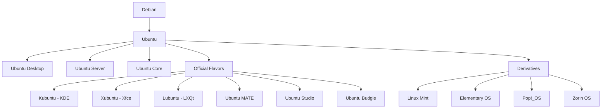
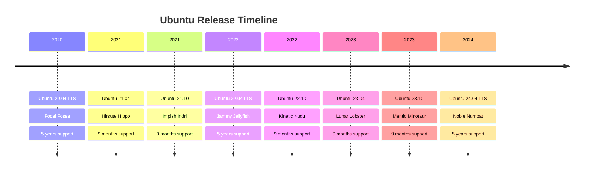
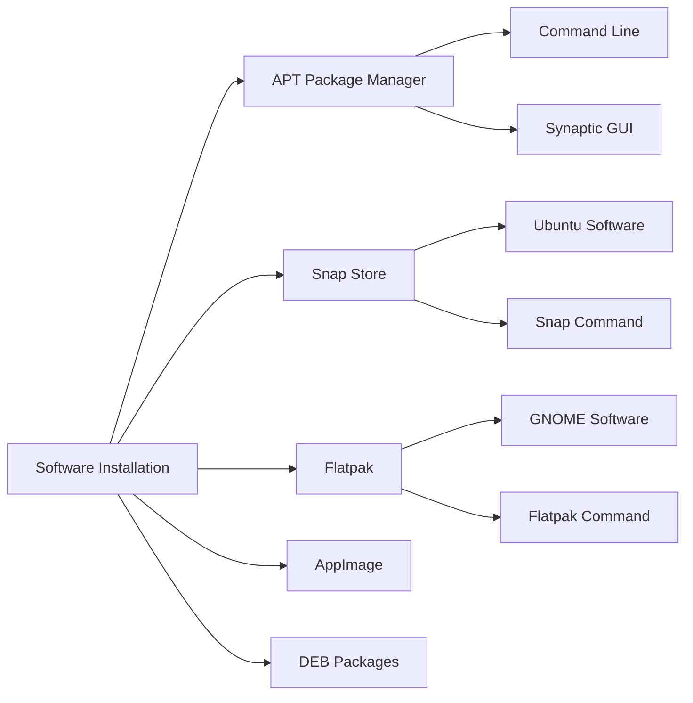
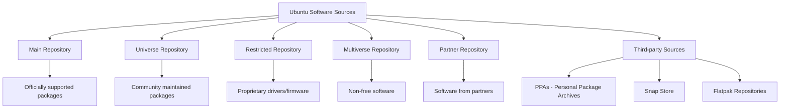
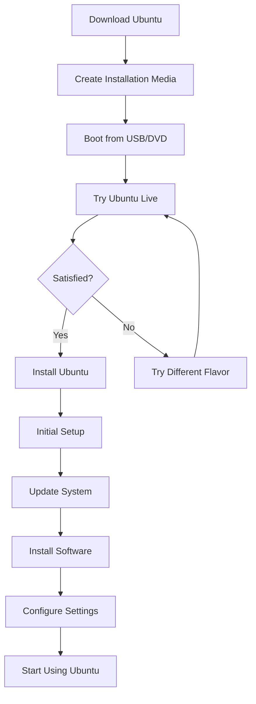
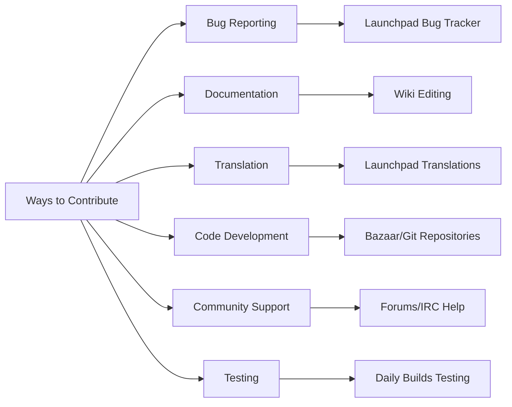

# Introduction to Ubuntu: What and Why?

## What is Ubuntu?

Ubuntu is a **free and open-source Linux distribution** based on Debian. It's designed to be user-friendly, secure, and accessible to both beginners and advanced users. Ubuntu is one of the most popular Linux distributions, known for its stability, extensive community support, and regular release cycle.

## Ubuntu Philosophy

Ubuntu is built on the African philosophy of **"Ubuntu"** which means *"I am because we are"* - emphasizing community, sharing, and interconnectedness.

### Core Values
- **Free Software**: No licensing fees, complete freedom to use, modify, and distribute
- **Community Driven**: Developed by a global community of volunteers
- **Security First**: Built-in security features and regular updates
- **Accessibility**: Designed to be usable by everyone

## Ubuntu Family Tree



## Ubuntu Release Cycle

### LTS vs Regular Releases



### Version Naming Scheme

Ubuntu versions follow the pattern: **YY.MM** (Year.Month)
- **20.04**: Released in April 2020
- **22.04**: Released in April 2022
- **24.04**: Released in April 2024

## Why Choose Ubuntu?

### 1. **User-Friendly Interface**

Ubuntu provides an intuitive desktop environment that's easy to navigate:

```
┌─────────────────────────────────────────┐
│ ☰ Activities    🕐 Time    🔋 ⚙️ 👤    │  ← Top Bar
├─────────────────────────────────────────┤
│                                         │
│     🗂️ Files    🌐 Firefox             │  ← Application Icons
│                                         │
│     ⚙️ Settings  📝 Text Editor        │
│                                         │
│     📦 Software  🎵 Music              │
│                                         │
│                                         │
├─────────────────────────────────────────┤
│ 🗂️ Files 🌐 Firefox 📧 Mail 📱 Phone │  ← Dock
└─────────────────────────────────────────┘
```

### 2. **Security and Stability**

- **Built-in Firewall**: UFW (Uncomplicated Firewall)
- **Automatic Security Updates**: Critical patches applied automatically
- **Sandboxed Applications**: Snap packages run in isolation
- **Encrypted Storage**: Full disk encryption options
- **Regular Security Audits**: Community-driven security reviews

### 3. **Software Management**

Ubuntu offers multiple ways to install software:



### 4. **Hardware Compatibility**

Ubuntu supports a wide range of hardware:

| Hardware Type | Support Level | Notes |
|---------------|---------------|-------|
| **Intel/AMD CPUs** | Excellent | Full support for modern processors |
| **NVIDIA Graphics** | Very Good | Proprietary drivers available |
| **AMD Graphics** | Excellent | Open-source drivers included |
| **WiFi Adapters** | Very Good | Most adapters work out-of-box |
| **Printers** | Excellent | CUPS printing system |
| **Touchscreens** | Good | Basic multi-touch support |

### 5. **Development Environment**

Ubuntu is excellent for developers:

```bash
# Pre-installed development tools
gcc --version        # GNU Compiler Collection
python3 --version    # Python programming language
git --version        # Version control system
ssh --version        # Secure Shell

# Easy installation of development tools
sudo apt update
sudo apt install nodejs npm       # Node.js development
sudo apt install openjdk-17-jdk  # Java development
sudo apt install docker.io       # Containerization
```

## Ubuntu Editions

### 1. **Ubuntu Desktop**
- **Target**: Home users, developers, students
- **Desktop Environment**: GNOME (default)
- **Features**: Complete desktop experience with GUI
- **System Requirements**: 
  - 4 GB RAM (minimum), 8 GB recommended
  - 25 GB disk space
  - 1 GHz dual-core processor

### 2. **Ubuntu Server**
- **Target**: Servers, cloud deployments, IoT
- **Interface**: Command-line only
- **Features**: Optimized for server workloads
- **System Requirements**:
  - 1 GB RAM (minimum), 2 GB recommended
  - 2.5 GB disk space
  - 1 GHz processor

### 3. **Ubuntu Core**
- **Target**: IoT devices, embedded systems
- **Package System**: Snap-only
- **Features**: Minimal, transactional updates
- **Benefits**: Automatic security updates, rollback capability

## Ubuntu Desktop Environments

### GNOME (Default)

```
Features:
├── Modern Design
├── Touch-friendly Interface
├── Extension Support
├── Integrated Search
└── Accessibility Features
```

### Available Alternatives

| Desktop Environment | Flavor | Resource Usage | Best For |
|-------------------|---------|----------------|----------|
| **KDE Plasma** | Kubuntu | Medium-High | Power users, customization |
| **Xfce** | Xubuntu | Low | Older hardware, simplicity |
| **LXQt** | Lubuntu | Very Low | Very old hardware |
| **MATE** | Ubuntu MATE | Low-Medium | Traditional desktop feel |
| **Budgie** | Ubuntu Budgie | Medium | Modern, elegant interface |

## Package Management

### APT (Advanced Package Tool)

```bash
# Update package lists
sudo apt update

# Upgrade installed packages
sudo apt upgrade

# Install new software
sudo apt install package-name

# Remove software
sudo apt remove package-name

# Search for packages
apt search keyword

# Show package information
apt show package-name

# List installed packages
apt list --installed
```

### Snap Packages

```bash
# Install snap package
sudo snap install package-name

# List installed snaps
snap list

# Update all snaps
sudo snap refresh

# Remove snap package
sudo snap remove package-name

# Search for snaps
snap find keyword
```

### Software Sources



## File System Structure

```
/                    ← Root directory
├── bin/            ← Essential command binaries
├── boot/           ← Boot loader files
├── dev/            ← Device files
├── etc/            ← Configuration files
├── home/           ← User home directories
│   └── username/   ← Your personal directory
├── lib/            ← Essential shared libraries
├── media/          ← Removable media mount points
├── mnt/            ← Temporary mount points
├── opt/            ← Optional software packages
├── proc/           ← Process information
├── root/           ← Root user's home directory
├── run/            ← Runtime variable data
├── sbin/           ← System administration binaries
├── srv/            ← Service data
├── sys/            ← System information
├── tmp/            ← Temporary files
├── usr/            ← User programs and data
│   ├── bin/        ← User command binaries
│   ├── lib/        ← Libraries for /usr/bin and /usr/sbin
│   ├── local/      ← Local hierarchy
│   └── share/      ← Architecture-independent data
└── var/            ← Variable data files
    ├── log/        ← Log files
    ├── cache/      ← Application cache data
    └── lib/        ← Variable state information
```

## Terminal and Command Line

### Essential Commands

```bash
# Navigation
pwd                 # Print working directory
ls                  # List directory contents
cd /path/to/dir     # Change directory
cd ~                # Go to home directory
cd ..               # Go up one directory

# File Operations
cp source dest      # Copy files/directories
mv source dest      # Move/rename files
rm filename         # Remove file
rm -rf directory    # Remove directory recursively
mkdir dirname       # Create directory
touch filename      # Create empty file

# File Viewing
cat filename        # Display file contents
less filename       # View file page by page
head filename       # Show first 10 lines
tail filename       # Show last 10 lines
grep pattern file   # Search for pattern in file

# System Information
top                 # Show running processes
ps aux              # List all processes
df -h               # Show disk usage
free -h             # Show memory usage
uname -a            # System information
whoami              # Current username
```

### File Permissions

```bash
# Understanding permissions: rwxrwxrwx
# r = read (4), w = write (2), x = execute (1)
# First rwx: Owner, Second rwx: Group, Third rwx: Others

# Change permissions
chmod 755 filename  # rwxr-xr-x
chmod +x script     # Add execute permission
chmod -w file       # Remove write permission

# Change ownership
sudo chown user:group filename
sudo chown -R user:group directory/
```

## Ubuntu for Different Use Cases

### 1. **Home Desktop**
- **Web browsing**: Firefox, Chrome
- **Office suite**: LibreOffice
- **Media**: VLC, Rhythmbox
- **Graphics**: GIMP, Inkscape

### 2. **Development Workstation**
- **IDEs**: VS Code, IntelliJ IDEA, Eclipse
- **Programming languages**: Python, Java, Node.js, C++
- **Version control**: Git, GitHub Desktop
- **Containers**: Docker, Podman

### 3. **Server Environment**
- **Web servers**: Apache, Nginx
- **Databases**: MySQL, PostgreSQL, MongoDB
- **Monitoring**: Prometheus, Grafana
- **Automation**: Ansible, Puppet

### 4. **Educational Institution**
- **Classroom management**: Epoptes
- **Educational software**: GCompris, Stellarium
- **Programming education**: Scratch, Python IDLE
- **Cost-effective**: No licensing fees

## Getting Started Workflow



### Installation Options

1. **Dual Boot**: Keep existing OS alongside Ubuntu
2. **Replace OS**: Complete Ubuntu installation
3. **Virtual Machine**: Run Ubuntu inside another OS
4. **Live USB**: Portable Ubuntu without installation

## Community and Support

### Getting Help

| Resource | Type | Best For |
|----------|------|----------|
| **Ubuntu Forums** | Community | General questions, troubleshooting |
| **Ask Ubuntu** | Q&A Site | Specific technical problems |
| **Ubuntu Documentation** | Official | Comprehensive guides |
| **IRC/Discord** | Real-time Chat | Quick questions, discussions |
| **Local User Groups** | In-person | Networking, learning |

### Contributing Back



## Advantages Summary

| Advantage | Description |
|-----------|-------------|
| **Free** | No cost for download, use, or distribution |
| **Secure** | Built-in security features and regular updates |
| **Stable** | Reliable for both personal and professional use |
| **Customizable** | Modify interface and behavior to your needs |
| **Community** | Large, helpful community for support |
| **Privacy** | No data collection or telemetry by default |
| **Performance** | Efficient resource usage |
| **Compatibility** | Runs on wide range of hardware |

## Common Use Cases

### For Beginners
- Replace Windows/macOS with familiar interface
- Learn Linux without complexity
- Safe environment for experimentation

### For Developers
- Native development environment
- Package management for tools
- Container support built-in

### For System Administrators
- Server management and automation
- Cloud deployment platform
- Enterprise support available

### For Students
- Free alternative to expensive software
- Learning programming and system administration
- Academic discounts not needed

## Next Steps

After understanding Ubuntu basics:

1. **[Install Ubuntu on your system](ubuntu-installation.md)**
2. **[Learn basic terminal commands](ubuntu-terminal-basics.md)**
3. **[Explore the desktop environment](ubuntu-desktop-environment.md)**
4. **[Install and manage software](ubuntu-software-installation.md)**

Ubuntu represents freedom, community, and accessibility in computing. Whether you're a complete beginner or an experienced user, Ubuntu provides a solid foundation for your computing needs while respecting your privacy and giving you complete control over your system.
