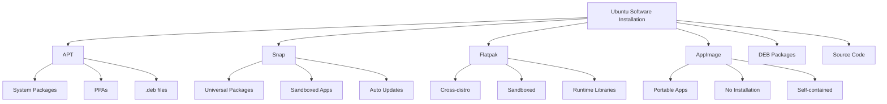
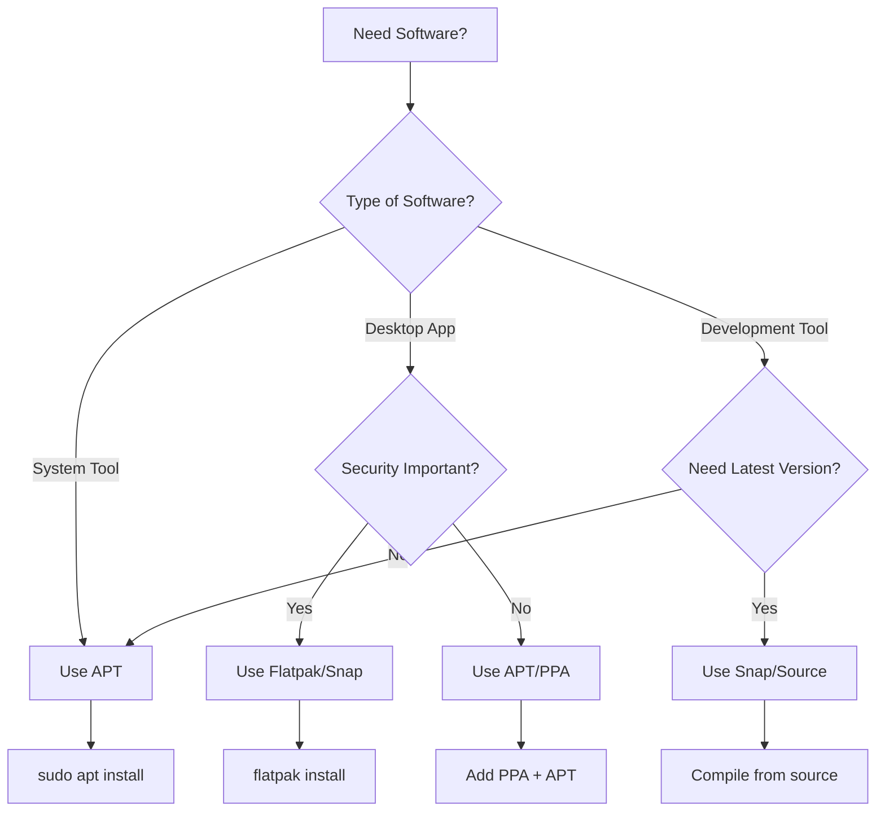

# Software Installation in Ubuntu (APT, Snap, Flatpak)

## Overview

Ubuntu offers multiple package management systems for installing software. Each has its own advantages and use cases. This guide covers APT, Snap, Flatpak, and other installation methods comprehensively.

## Package Management Systems Comparison



| Feature | APT | Snap | Flatpak | AppImage |
|---------|-----|------|---------|----------|
| **Security** | System-level | Sandboxed | Sandboxed | Varies |
| **Updates** | Manual/Automatic | Automatic | Manual | Manual |
| **Size** | Small | Large | Medium | Large |
| **Performance** | Fast | Slower startup | Medium | Fast |
| **Permissions** | Full system | Confined | Confined | Varies |

## APT Package Manager

### Understanding APT

APT (Advanced Package Tool) is the default package manager for Ubuntu, handling .deb packages and system libraries.

### Basic APT Commands

```bash
# Update package lists
sudo apt update

# Upgrade installed packages
sudo apt upgrade

# Full system upgrade
sudo apt full-upgrade

# Install package
sudo apt install package-name

# Install multiple packages
sudo apt install package1 package2 package3

# Remove package
sudo apt remove package-name

# Remove package and configuration files
sudo apt purge package-name

# Remove orphaned packages
sudo apt autoremove

# Clean package cache
sudo apt autoclean
sudo apt clean
```

### Search and Information

```bash
# Search for packages
apt search keyword

# Show package information
apt show package-name

# List installed packages
apt list --installed

# List upgradable packages
apt list --upgradable

# Check if package is installed
dpkg -l | grep package-name

# Show package dependencies
apt depends package-name

# Show reverse dependencies
apt rdepends package-name
```

### Repository Management

```bash
# List repositories
grep -rhE ^deb /etc/apt/sources.list*

# Add repository key
wget -qO - https://example.com/key.gpg | sudo apt-key add -

# Add repository (modern method)
curl -fsSL https://example.com/key.gpg | sudo gpg --dearmor -o /usr/share/keyrings/example.gpg
echo "deb [signed-by=/usr/share/keyrings/example.gpg] https://example.com/repo stable main" | sudo tee /etc/apt/sources.list.d/example.list

# Update after adding repository
sudo apt update
```

### Installing Software with APT

#### Development Tools

```bash
# Build essentials
sudo apt install build-essential

# Programming languages
sudo apt install python3 python3-pip
sudo apt install nodejs npm
sudo apt install openjdk-17-jdk
sudo apt install golang-go
sudo apt install rust-all

# Version control
sudo apt install git subversion

# Text editors
sudo apt install vim neovim emacs
sudo apt install code  # May need Microsoft repository
```

#### Media and Graphics

```bash
# Media players
sudo apt install vlc audacious rhythmbox

# Graphics editors
sudo apt install gimp inkscape blender

# Image viewers
sudo apt install eog gwenview

# Video editing
sudo apt install kdenlive openshot
```

#### System Tools

```bash
# File managers
sudo apt install nautilus dolphin thunar

# Archive tools
sudo apt install p7zip-full unrar

# System monitoring
sudo apt install htop btop neofetch

# Network tools
sudo apt install curl wget nmap
```

## Snap Package Manager

### What are Snap Packages?

Snap packages are containerized software packages that work across Linux distributions. They include all dependencies and run in sandboxed environments.

### Basic Snap Commands

```bash
# List installed snaps
snap list

# Search for snaps
snap find keyword

# Install snap
sudo snap install package-name

# Install from specific channel
sudo snap install package-name --channel=stable
sudo snap install package-name --beta
sudo snap install package-name --edge

# Update all snaps
sudo snap refresh

# Update specific snap
sudo snap refresh package-name

# Remove snap
sudo snap remove package-name

# Show snap information
snap info package-name
```

### Snap Channels

```bash
# Channels explained:
# stable   - Production-ready releases
# candidate - Release candidates
# beta     - Beta releases
# edge     - Development builds

# Install from specific channel
sudo snap install code --classic --channel=stable
sudo snap install discord --beta
```

### Popular Snap Applications

```bash
# Development
sudo snap install code --classic
sudo snap install intellij-idea-ultimate --classic
sudo snap install atom --classic
sudo snap install sublime-text --classic

# Media
sudo snap install vlc
sudo snap install spotify
sudo snap install discord

# Productivity
sudo snap install firefox
sudo snap install chromium
sudo snap install slack --classic
sudo snap install teams

# Graphics
sudo snap install gimp
sudo snap install inkscape
sudo snap install blender --classic
```

### Snap Configuration

```bash
# View snap connections
snap connections package-name

# Connect interface
sudo snap connect package-name:interface

# Disconnect interface
sudo snap disconnect package-name:interface

# View snap services
snap services

# Start/stop snap service
sudo snap start package-name.service
sudo snap stop package-name.service
```

## Flatpak Package Manager

### Installing Flatpak

```bash
# Install Flatpak
sudo apt install flatpak

# Add Flathub repository
flatpak remote-add --if-not-exists flathub https://flathub.org/repo/flathub.flatpakrepo

# Install GNOME Software Flatpak plugin
sudo apt install gnome-software-plugin-flatpak

# Restart system (recommended)
sudo reboot
```

### Basic Flatpak Commands

```bash
# Search for applications
flatpak search keyword

# Install application
flatpak install flathub application-id

# List installed applications
flatpak list

# Update all applications
flatpak update

# Update specific application
flatpak update application-id

# Remove application
flatpak uninstall application-id

# Show application information
flatpak info application-id

# Run application
flatpak run application-id
```

### Popular Flatpak Applications

```bash
# Browsers
flatpak install flathub org.mozilla.firefox
flatpak install flathub com.google.Chrome

# Development
flatpak install flathub com.visualstudio.code
flatpak install flathub org.gnome.Builder

# Media
flatpak install flathub org.videolan.VLC
flatpak install flathub com.spotify.Client

# Graphics
flatpak install flathub org.gimp.GIMP
flatpak install flathub org.inkscape.Inkscape

# Office
flatpak install flathub org.libreoffice.LibreOffice
flatpak install flathub com.github.johnfactotum.Foliate
```

### Flatpak Management

```bash
# List remotes
flatpak remotes

# Add remote repository
flatpak remote-add --if-not-exists remotename https://repo-url

# Remove remote repository
flatpak remote-delete remotename

# Clean up unused runtimes
flatpak uninstall --unused

# Show repository information
flatpak remote-info flathub application-id
```

## AppImage Applications

### What are AppImages?

AppImages are portable application packages that don't require installation. They contain the application and all its dependencies.

### Using AppImages

```bash
# Download AppImage
wget https://example.com/app.AppImage

# Make executable
chmod +x app.AppImage

# Run application
./app.AppImage

# Integrate with system (optional)
./app.AppImage --appimage-integrate

# Remove integration
./app.AppImage --appimage-remove
```

### AppImage Management Tools

```bash
# AppImageLauncher (GUI manager)
sudo add-apt-repository ppa:appimagelauncher-team/stable
sudo apt update
sudo apt install appimagelauncher

# AppImagePool (store-like interface)
flatpak install flathub io.github.prateekmedia.appimagepool
```

## Software Centers and GUI Tools

### Ubuntu Software Center

```bash
# Launch Ubuntu Software
gnome-software

# Or from command line
ubuntu-software

# Features:
# - Browse categories
# - Install/remove packages
# - Automatic updates
# - Reviews and ratings
```

### Synaptic Package Manager

```bash
# Install Synaptic
sudo apt install synaptic

# Launch
sudo synaptic

# Features:
# - Advanced package management
# - Repository management
# - Package information
# - Dependency resolution
```

### AppCenter (elementary OS style)

```bash
# Install AppCenter
sudo apt install appcenter

# Alternative: GNOME Software
sudo apt install gnome-software
```

## Installing from Source Code

### Prerequisites

```bash
# Install build tools
sudo apt install build-essential
sudo apt install cmake
sudo apt install autotools-dev
sudo apt install pkg-config

# Install common dependencies
sudo apt install libssl-dev
sudo apt install libcurl4-openssl-dev
sudo apt install zlib1g-dev
```

### Typical Source Installation

```bash
# Download source code
wget https://example.com/source.tar.gz
tar -xzf source.tar.gz
cd source-directory

# Configure build
./configure --prefix=/usr/local

# Or with CMake
mkdir build && cd build
cmake ..

# Compile
make -j$(nproc)

# Install
sudo make install

# Or using checkinstall (creates .deb package)
sudo apt install checkinstall
sudo checkinstall
```

### Python Packages

```bash
# Using pip
pip3 install package-name

# User installation (recommended)
pip3 install --user package-name

# Virtual environment (best practice)
python3 -m venv myenv
source myenv/bin/activate
pip install package-name
```

### Node.js Packages

```bash
# Global installation
sudo npm install -g package-name

# Local installation
npm install package-name

# Using Yarn
npm install -g yarn
yarn global add package-name
```

## Adding PPAs (Personal Package Archives)

### Understanding PPAs

PPAs are user-contributed repositories that provide newer or additional software not available in official Ubuntu repositories.

### Managing PPAs

```bash
# Add PPA
sudo add-apt-repository ppa:user/ppa-name
sudo apt update

# Remove PPA
sudo add-apt-repository --remove ppa:user/ppa-name
sudo apt update

# List PPAs
grep -rhE ^deb.*ppa /etc/apt/sources.list*

# Purge PPA packages
sudo ppa-purge ppa:user/ppa-name
```

### Popular PPAs

```bash
# Graphics drivers
sudo add-apt-repository ppa:graphics-drivers/ppa

# LibreOffice
sudo add-apt-repository ppa:libreoffice/ppa

# Git (latest version)
sudo add-apt-repository ppa:git-core/ppa

# OBS Studio
sudo add-apt-repository ppa:obsproject/obs-studio

# Wine
sudo add-apt-repository ppa:wine/wine-builds
```

## Package Installation Strategies

### Choosing the Right Package Format



### Installation Priority

1. **APT (Official repositories)** - First choice for system packages
2. **Snap/Flatpak** - For desktop applications requiring sandboxing
3. **PPA** - For newer versions of existing packages
4. **AppImage** - For portable applications
5. **Source compilation** - Last resort or specific requirements

## Troubleshooting Installation Issues

### Common APT Issues

```bash
# Problem: Broken packages
sudo apt --fix-broken install
sudo dpkg --configure -a

# Problem: Lock file exists
sudo rm /var/lib/apt/lists/lock
sudo rm /var/cache/apt/archives/lock
sudo rm /var/lib/dpkg/lock*

# Problem: GPG key errors
sudo apt-key adv --keyserver keyserver.ubuntu.com --recv-keys KEY-ID

# Problem: Repository not found
sudo apt update 2>&1 | grep -E "Failed to fetch|404"
# Remove problematic repositories from /etc/apt/sources.list.d/
```

### Snap Issues

```bash
# Problem: Snap not connecting
sudo snap connect app-name:interface-name

# Problem: Snap not starting
snap logs app-name

# Problem: Permission issues
sudo snap refresh --devmode app-name

# Problem: Interface not available
snap interface interface-name
```

### Flatpak Issues

```bash
# Problem: Runtime missing
flatpak install flathub org.freedesktop.Platform//22.08

# Problem: Permission issues
flatpak override --user --filesystem=home app-id

# Problem: Application won't start
flatpak run --verbose app-id
```

## Automation and Scripting

### Automated Installation Script

```bash
#!/bin/bash
# install-essentials.sh

set -e

echo "Updating system..."
sudo apt update && sudo apt upgrade -y

echo "Installing essential packages..."
sudo apt install -y \
    curl \
    wget \
    git \
    vim \
    htop \
    tree \
    unzip \
    software-properties-common \
    apt-transport-https \
    ca-certificates \
    gnupg \
    lsb-release

echo "Installing development tools..."
sudo apt install -y \
    build-essential \
    python3-pip \
    nodejs \
    npm

echo "Installing media codecs..."
sudo apt install -y ubuntu-restricted-extras

echo "Installing Flatpak..."
sudo apt install -y flatpak
flatpak remote-add --if-not-exists flathub https://flathub.org/repo/flathub.flatpakrepo

echo "Installing Snap applications..."
sudo snap install code --classic
sudo snap install discord
sudo snap install vlc

echo "Installation complete!"
```

### Package List Management

```bash
# Export installed packages
dpkg --get-selections > installed-packages.txt
snap list > installed-snaps.txt
flatpak list > installed-flatpaks.txt

# Install from package list
sudo dpkg --set-selections < installed-packages.txt
sudo apt dselect-upgrade
```

## Security Considerations

### Package Verification

```bash
# Verify package signatures
apt-key list

# Check package integrity
debsums package-name

# Verify Snap publisher
snap info package-name | grep publisher
```

### Safe Installation Practices

1. **Use official repositories first**
2. **Verify PPA sources** before adding
3. **Check application permissions** for Snaps/Flatpaks
4. **Keep system updated** regularly
5. **Remove unused packages** periodically

### Repository Trust

```bash
# Check repository signatures
apt-key fingerprint

# Add trusted keys properly
curl -fsSL https://example.com/key.gpg | sudo gpg --dearmor -o /usr/share/keyrings/example.gpg

# Avoid apt-key add (deprecated)
# Use gpg --dearmor instead
```

## Performance Optimization

### Package Cache Management

```bash
# Check cache size
du -sh /var/cache/apt/archives/

# Clean cache
sudo apt autoclean  # Remove old package files
sudo apt clean     # Remove all package files

# Configure cache limit
echo 'APT::Cache-Limit "100000000";' | sudo tee /etc/apt/apt.conf.d/70cache-limit
```

### Parallel Downloads

```bash
# Enable parallel downloads for APT
echo 'APT::Acquire::Max-Workers "4";' | sudo tee /etc/apt/apt.conf.d/99parallel

# Configure fastest mirror
sudo apt install apt-fast
```

## Best Practices

### Regular Maintenance

```bash
# Weekly maintenance script
#!/bin/bash
sudo apt update
sudo apt upgrade -y
sudo apt autoremove -y
sudo apt autoclean
sudo snap refresh
flatpak update -y
```

### Package Selection Guidelines

1. **System integration**: Use APT for system-level software
2. **Security**: Use Flatpak/Snap for untrusted applications
3. **Portability**: Use AppImage for portable tools
4. **Development**: Use language-specific package managers when appropriate

## Next Steps

After mastering software installation:

1. **[Learn system update management](ubuntu-system-update.md)**
2. **[Configure user permissions](ubuntu-user-permissions.md)**
3. **[Set up development environment](ubuntu-software-development.md)**
4. **[Explore system monitoring](ubuntu-system-monitoring.md)**

## Summary

Ubuntu's multiple package management systems provide flexibility for different use cases:

| Use Case | Recommended Method | Example |
|----------|-------------------|---------|
| **System tools** | APT | `sudo apt install htop` |
| **Desktop apps** | Snap/Flatpak | `snap install discord` |
| **Development** | Language managers | `npm install -g package` |
| **Portable tools** | AppImage | Download and run |
| **Latest versions** | PPA + APT | Add PPA, then APT install |

Understanding these different approaches allows you to choose the best installation method for each situation while maintaining system security and performance.
